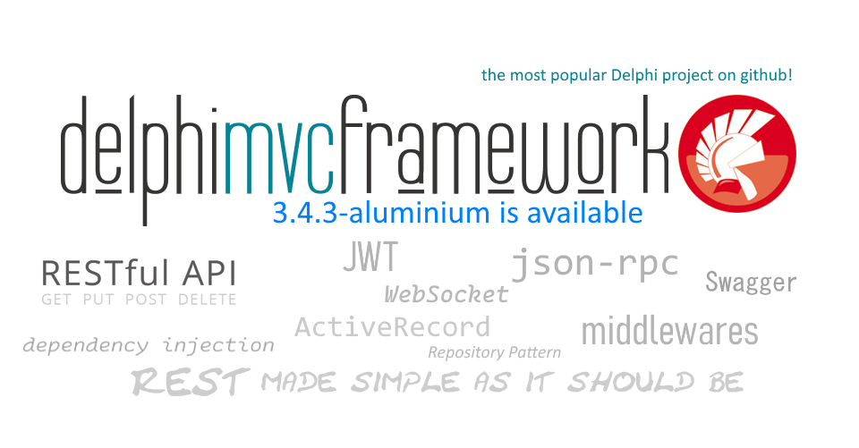
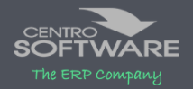
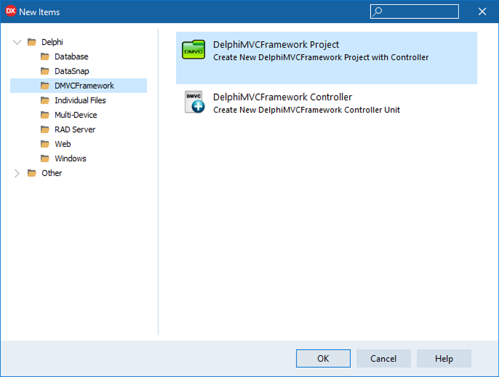

# DelphiMVCFramework  


  

<!-- START doctoc generated TOC please keep comment here to allow auto update -->
<!-- DON'T EDIT THIS SECTION, INSTEAD RE-RUN doctoc TO UPDATE -->
**Table of Contents**

  - [What's DelphiMVCFramework](#whats-delphimvcframework)
  - [Support DMVCFramework](#support-dmvcframework)
    - [DelphiMVCFramework Main Features](#delphimvcframework-main-features)
  - [Install the latest stable version](#install-the-latest-stable-version)
  - [Book: "DelphiMVCFramework - the official guide"](#book-delphimvcframework---the-official-guide)
    - [Book translations](#book-translations)
    - [How to partecipate to DMVCFramework development and/or tests](#how-to-partecipate-to-dmvcframework-development-andor-tests)
  - [Sponsors](#sponsors)
  - [What users say about DMVCFramework](#what-users-say-about-dmvcframework)
  - [What's New in dmvcframework-3.3.0-fluorine (last stable version)](#whats-new-in-dmvcframework-330-fluorine-last-stable-version)
  - [What's New in the next "repo version" a.k.a. 3.4.0-neon](#whats-new-in-the-next-repo-version-aka-340-neon)
  - [Old Versions](#old-versions)
    - [What's New in dmvcframework-3.2.3-radium](#whats-new-in-dmvcframework-323-radium)
    - [Bug Fix in 3.2.3-radium](#bug-fix-in-323-radium)
    - [What's new in DelphiMVCFramework-3.2.2-nitrogen](#whats-new-in-delphimvcframework-322-nitrogen)
    - [Bug Fixes in 3.2.2-nitrogen](#bug-fixes-in-322-nitrogen)
    - [Breaking Changes in 3.2.2-nitrogen](#breaking-changes-in-322-nitrogen)
    - [What's New in DelphiMVCFramework 3.2.1-carbon](#whats-new-in-delphimvcframework-321-carbon)
      - [Improvements](#improvements)
    - [What's New in 3.2.0-boron](#whats-new-in-320-boron)
      - [Breaking Changes in 3.2.0-boron](#breaking-changes-in-320-boron)
      - [Bug Fixes in 3.2.0-boron](#bug-fixes-in-320-boron)
    - [What's New in 3.1.0-lithium](#whats-new-in-310-lithium)
    - [What's New in 3.0.0-hydrogen](#whats-new-in-300-hydrogen)
    - [What's New in 2.1.3-lithium](#whats-new-in-213-lithium)
    - [What's New in 2.1.2-helium](#whats-new-in-212-helium)
    - [What's New in 2.1.1-hydrogen](#whats-new-in-211-hydrogen)
  - [Roadmap](#roadmap)
  - [Next Release: 3.3.0-fluorine-beta ("repo" version)](#next-release-330-fluorine-beta-repo-version)
  - [What's new in: 3.3.0-fluorine-beta ("repo" version)](#whats-new-in-330-fluorine-beta-repo-version)
  - [Trainings, consultancy or custom development service](#trainings-consultancy-or-custom-development-service)
  - [Samples and documentation](#samples-and-documentation)
- [Getting Started: 5 minutes guide](#getting-started-5-minutes-guide)
  - [DelphiMVCFramework Installation](#delphimvcframework-installation)
  - [Sample Controller](#sample-controller)
  - [How to create a dmvcframework servers container](#how-to-create-a-dmvcframework-servers-container)
- [RQL Introduction](#rql-introduction)
    - [RQL as Implemented by DMVCFramework](#rql-as-implemented-by-dmvcframework)
- [dotEnv syntax](#dotenv-syntax)
  - [Links](#links)

<!-- END doctoc generated TOC please keep comment here to allow auto update -->



<!-- START doctoc -->
<!-- END doctoc -->

## What's DelphiMVCFramework

DMVCFramework is a very popular Delphi framework which provides an easy to use, scalable, flexible [RESTful](https://en.wikipedia.org/wiki/Representational_state_transfer), [JSON-RPC](https://en.wikipedia.org/wiki/JSON-RPC) and [ActiveRecord](https://www.martinfowler.com/eaaCatalog/activeRecord.html) framework for Delphi developers. DMVCFramework is the **most popular** Delphi project on GitHub and compiles for Windows (32 and 64bit) and Linux (64bit). DMVCFramework services can be compiled as console application,  Windows Service, Linux daemon, Apache module (Windows and Linux) and IIS ISAPI (Windows).

DMVCFramework works with Delphi 11 Alexandria, Delphi 10.4 Sydney, Delphi 10.3 Rio, Delphi 10.2 Tokyo, Delphi 10.1 Berlin,  Delphi 10 Seattle.

## Support DMVCFramework

Are you using DMVCFramework? Do you want to say "Thanks"? <a href="https://www.patreon.com/bePatron?u=72182967" data-patreon-widget-type="become-patron-button">Become a Patron!</a>

### DelphiMVCFramework Main Features

  * DMVCFramwork is simple to use, has a [lot of examples](https://github.com/danieleteti/delphimvcframework/tree/master/samples), is documented and there are a [lot of tutorials](https://www.youtube.com/results?search_query=delphimvcframework) available.

  * DMVCFramework is very well documented and the book [DMVCFramework - the official guide](http://www.danieleteti.it/books/) is available to fastly get a solid knowledge (available as e-book and hardcopy).

  * [Project Roadmap](roadmap.md) is always public
* There are more than 40 samples to learn all the features and be proficient and productive
* Commercially supported by [bit Time Professionals](http://www.bittimeprofessionals.it) (training, consultancy, custom development etc.)

* RESTful (RMM Level 3) compliant

* JSON-RPC 2.0 Support with automatic objects remotization (check [sample](https://github.com/danieleteti/delphimvcframework/tree/master/samples/jsonrpc_with_published_objects))

* DMVCFramework' MVCActiveRecord allows an easy and fast database access.

* Stable and solid, used by small/mid/big projects since 2010

* Very fast! (2.x was pretty fast and now, 3.x is 60% faster than the 2.x!)

* Support group at https://www.facebook.com/groups/delphimvcframework with more than 4900 active members

* Can be used in load balanced environment

* Wizard for the Delphi IDE. It makes DelphiMVCFramework even more simple to use!

* Optional session support

* JSON Web Token Support (JWT) (check [sample](https://github.com/danieleteti/delphimvcframework/tree/master/samples/jsonwebtoken))

* Extendable using middleware - simple hooks to handle request/response (check [sample](https://github.com/danieleteti/delphimvcframework/tree/master/samples/middleware))

* Flexible yet simple to use, authorization/authentication framework based on industry standards.
  * HTTP Basic Authentication
  * JWT Authentication
  * Custom Authentication
  * CORS support

* Controllers inheritance! You can define your own base controller and inherit from it.

* Fancy URL with parameter mappings
* Specialized renders to generate text, HTML, JSON.
* Powerful and customizable mapper to serialize/deserialize data.
* Can be packaged as stand alone server, apache module (XE6 or better) and ISAPI dll

* Integrated REST Client
* Works on Linux (Delphi 10.2 Tokyo or better)
* Completely unit tested (more than 250 unit tests)
* There is a sample for each functionality (check the [dmvcframework_(yourversion)_samples.zip](https://github.com/danieleteti/delphimvcframework/releases))

* Server side generated pages using [Mustache for Delphi](https://github.com/synopse/dmustache) or [TemplatePro](https://github.com/danieleteti/templatepro)

* Specific trainings are available (email to `professionals@bittime.it` for a date and a place)

* Push notifications support using [ServerSentEvents](https://github.com/danieleteti/delphimvcframework/tree/master/samples/serversentevents)

* Automatic documentation through `/system/describeserver.info`

* Driven by its huge community (Facebook group https://www.facebook.com/groups/delphimvcframework)

* Semantic Versioning

* To get a fast introduction to DMVCFramework read the [slides from ITDevCon conference](docs/ITDevCON%202013%20-%20Introduction%20to%20DelphiMVCFramework.pdf)


## Install the latest stable version

> If you are not involved in development or testing, do not clone the repo! Use the Github release!

The last stable version is **dmvcframework-3.2.3-radium** available [here 📥](https://github.com/danieleteti/delphimvcframework/releases/latest). Just download latest release as a zip file and you are ok. The samples are availables as separate zip file downloadable from the same page where you download the release.

## Book: "DelphiMVCFramework - the official guide"

The official guide for DMVCFramework is available. DMVCFramework has a lot functionalities and can really help your business. However many developers don't use it at its full potential. Why don't get more when is easily available? The DMVCFramework lead developer and project coordinator Daniele Teti, wrote the official guide for this great framework.


[Buy your copy](https://leanpub.com/delphimvcframework) and improve your DMVCFramework knowledge now!
"DMVCFramework - the official guide" is available as [e-book](https://leanpub.com/delphimvcframework) and [hardcopy](https://www.lulu.com/en/en/shop/daniele-teti-and-jim-mckeeth/delphimvcframework-the-official-guide/hardcover/product-r26e8e.html), pick what you prefer.

> While a huge work has been done by the author and the reviews to make the book and the examples well written, complete and effective, things can be always improved. For any suggestions, complains or requests there is the official Github book project (https://github.com/danieleteti/dmvcframeworktheofficialguide) where you can fill an issue and get in touch directly with the author. 

### Book translations

Given the success of DMVCFramework in the Delphi community, the official DMVCFramework guide has been translated also in the following languages.

- [Brazilian Portuguese](https://leanpub.com/delphimvcframework-br) (Translated by Diego Farisato)
- [Spanish](https://leanpub.com/delphimvcframework-es) (Translated by Josè Davalos)

---

**Please, if you use DMVCFramework "star" this project in GitHub! It cost nothing to you but helps other developers to reference the code.**


### How to partecipate to DMVCFramework development and/or tests

Only if you want to participate to the testing phase (which usually contains brand new features but can sometimes be instable) you can get the development version clonig this repo or downloading the [master repository zip file](https://github.com/danieleteti/delphimvcframework/archive/master.zip).
Take in mind that even if development version is usually very stable, it isn't not ready for production utilization.

## Sponsors

While DMVCFramework is born from the head of Daniele Teti from bit Time Professionals, it wouldn't what is now without the support and work of many people all around the world. The following companies sponsored some specific part of DMVCFramework so they wort a special mention.

**GOLD SPONSORS**

|COMPANY NAME | LOGO|
|-----------------------------------------------------------------------|------------------------------------------------------------------------|
|[bit Time Professionals ](https://www.bittimeprofessionals.com)		|  |
|[bit Time Software](https://www.bittime.it)                            |       |


**SILVER SPONSOR**

|COMPANY NAME | LOGO|
|-----------------------------------------------------------------------|------------------------------------------------------------------------|
|[Centro Software](https://www.centrosoftware.com)                      |  |
|[Delphi Studio ES](http://www.delphistudio.es)                         |    |
|[Orion Law](https://orionlaw.com/)                                     |        |
|[Vivaticket](https://www.vivaticket.com/)                              |      |


## What users say about DMVCFramework

> "Our wishes are coming true" -- one Delphi programmer after a small dmvcframework demo for an IT department of a very important national research institute

> "I'm still amazed by the DelphiMVCFramework code and documentation. Thank you very much and I am amazed by your quick feedback." -- [Benjamin Yang](https://www.linkedin.com/in/benjamin-yang-4b0609159/) (Director of [SQLGate](https://www.sqlgate.com/))

> "DMVCFramework and the Entity utility are fantastic!" -- Roberto

>"DMVCFramework is a great framework. It's very intuitive, fast, easy to use, actually there is nothing more to ask for." -- Samir

>"Wow! To do that in J2EE it takes 2 days" -- a training participant after a 5 minutes demo.

>"I'm starting with the DMVCFramework and I'm finding it fantastic, congratulations for the project!" -- Rafael

>"I'm looking at DMVCFramework project in it works great - for my use case scenarios is much better than *'Similar commercial product'*."  -- Luka

>"It's fantastic! Just define your entities and you are up and running in 5 minutes. Nothing comparable on the market." -- Marco

>"The best framework for creating web servers with Delphi! It is very easy to create Delphi servers and publish APIs and Rest resources.
Congratulations to Daniele Teti and all the staff for the excellent work!" -- Marcos N.

> We started the process of migrating our systems to micro services and are loving the DMVCFramework "DMVCFramework is definitely part of our lives right now". -- E. Costa

> "Thank you for the great framework! We are very happy with this!" -- Andreas

> "I managed to generate an API for my application thanks to this framework, it is truly useful and efficient!" -- J. Urbani


## What's New in dmvcframework-3.3.0-fluorine (last stable version)

- ⚡ Support for Delphi 11.3 Alexandria
- ⚡ Ability to use records in swagger param and response attributes [Issue 649](https://github.com/danieleteti/delphimvcframework/issues/649)
- ⚡ Improved Wizard - now it produces commented code to show how to use `ContextEvents`
- ⚡ Improved compatibility with Delphi 10.2 Tokyo and older versions (Thanks Mark Lobanov)
- ⚡ Added sample and middleware for Prometheus (using https://github.com/marcobreveglieri/prometheus-client-delphi)
- ⚡ Added "Profiler.LogsOnlyIfOverThreshold" which logs only if over the defined threshold
- 🐞 FIX [Issue 648](https://github.com/danieleteti/delphimvcframework/issues/648) Thanks to [sf-spb](https://github.com/sf-spb)
- 🐞 FIX [Issue 652](https://github.com/danieleteti/delphimvcframework/issues/652) Thanks to [BssdTS](https://github.com/BssdTS)
- 🐞 [PR 651](https://github.com/danieleteti/delphimvcframework/pull/651) Thanks to [Francisco Zanini](https://github.com/zaniniflz)


## What's New in the next "repo version" a.k.a. 3.4.0-neon

- ⚡ Added support for dotEnv multiline keys - added dotEnv show case

- ⚡ Added MSHeap memory manager for Win32 and Win64 (https://github.com/RDP1974/DelphiMSHeap)

- 🐞 FIX [Issue 664](https://github.com/danieleteti/delphimvcframework/issues/664) Thanks to [MPannier](https://github.com/MPannier)

- 🐞 FIX [Issue 667](https://github.com/danieleteti/delphimvcframework/issues/667)

- 🐞 FIX [Issue 680](https://github.com/danieleteti/delphimvcframework/issues/680)

- 🐞 FIX Wrong comparison in checks for ro/RW/PK fields in `TMVCActiveRecord`

- 🐞 FIX wrong default initialization for JWT (thanks to Flavio Basile)

- ⚡ Wizard updated to be dotEnv aware

- ⚡ Added "Load Style" methods to `TMVCActiveRecord` as suggested by https://github.com/danieleteti/delphimvcframework/issues/675

- ⚡ Better error message in case of serialization of `TArray<TObject>`

- ⚡ Improved CORS handling - [Issue 679](https://github.com/danieleteti/delphimvcframework/issues/679) (Thanks to [David Moorhouse](https://github.com/fastbike))

- ⚡ Improved serialization of `TObjectList<TDataSet>` (however `ObjectDict` is still the preferred way to serialize multiple datasets).

- ⚡ Added static method for easier cloning of FireDAC dataset into `TFDMemTable`. 

  - `class function CloneFrom(const FDDataSet: TFDDataSet): TFDMemTable`

  - Check sample "function_actions_showcase.dproj" for more info.

- ⚡ Functional Actions

  - In addition to the classic `procedure` based actions, now it's possibile to use functions as actions. The `Result` variable is automatically rendered and, if it is an object, its memory is freed.

    ```pascal
    type
      [MVCNameCase(ncCamelCase)]
      TPersonRec = record
        FirstName, LastName: String;
        Age: Integer;
        class function Create: TPersonRec; static;
      end;
    
      [MVCNameCase(ncCamelCase)]
      TPerson = class
      private
        fAge: Integer;
        fFirstName, fLastName: String;
      public
        property FirstName: String read fFirstName write fFirstName;
        property LastName: String read fLastName write fLastName;
        property Age: Integer read fAge write fAge;
      end;
    
      [MVCPath('/api')]
      TMyController = class(TMVCController)
      public
        { actions returning a simple type }
        [MVCPath('/sumsasinteger/($A)/($B)')]
        function GetSum(const A, B: Integer): Integer;
        [MVCPath('/sumsasfloat/($A)/($B)')]
        function GetSumAsFloat(const A, B: Extended): Extended;
    
        { actions returning records }
        [MVCPath('/records/single')]
        function GetSingleRecord: TPersonRec;
        [MVCPath('/records/multiple')]
        function GetMultipleRecords: TArray<TPersonRec>;
    
        { actions returning objects }
        [MVCPath('/objects/single')]
        function GetSingleObject: TPerson;
        [MVCPath('/objects/multiple')]
        function GetMultipleObjects: TObjectList<TPerson>;
    
        { actions returning datasets }
        [MVCPath('/datasets/single')]
        function GetSingleDataSet: TDataSet;
        [MVCPath('/datasets/multiple')]
        function GetMultipleDataSet: TEnumerable<TDataSet>;
        [MVCPath('/datasets/multiple2')]
        function GetMultipleDataSet2: IMVCObjectDictionary;
    
        { customize response headers }
        [MVCPath('/headers')]
        function GetWithCustomHeaders: TObjectList<TPerson>;
      end;
    ```

    Check sample "function_actions_showcase.dproj" for more info.

- ⚡ Improved `TMVCResponse` type to better suits the new functional actions. 

  `TMVCResponse` can be used with "message based" responses and also with "data based" responses (with single object, with a list of objects or with a dictionary of objects).

  **Message based responses**

  ```pascal
  function TMyController.GetMVCResponse: TMVCResponse;
  begin
    Result := MVCResponse(HTTP_STATUS.OK, 'My Message');
  end;
  ```

  Produces

  ```json
  {
      "message":"My Message"
  }
  ```
  
  

  **Data based response with single object**
  
  ```pascal
  function TMyController.GetMVCResponse2: TMVCResponse;
  begin
    Result := MVCResponse(HTTP_STATUS.OK, TPerson.Create('Daniele','Teti', 99));
  end;
  ```
  
  Produces
  
  ```json
  {
    "data": {
      "firstName": "Daniele",
      "lastName": "Teti",
      "age": 99
    }
  }
  ```
  
  **Data based response with list of objects**
  
  ```pascal
  function TMyController.GetMVCResponse3: TMVCResponse;
  begin
    Result := MVCResponse(HTTP_STATUS.OK,
      TObjectList<TPerson>.Create([
        TPerson.Create('Daniele','Teti', 99),
        TPerson.Create('Peter','Parker', 25),
        TPerson.Create('Bruce','Banner', 45)
      ])
    );
  end;
  ```
  
  Produces
  
  ```json
  {
    "data": [
      {
        "firstName": "Daniele",
        "lastName": "Teti",
        "age": 99
      },
      {
        "firstName": "Peter",
        "lastName": "Parker",
        "age": 25
      },
      {
        "firstName": "Bruce",
        "lastName": "Banner",
        "age": 45
      }
    ]
  }
  ```

  **Data dictionary based response with `IMVCObjectDictionary` **
  
  ```pascal
  function TMyController.GetMVCResponseWithObjectDictionary: IMVCResponse;
  begin
      Result := MVCResponse(
        HTTP_STATUS.OK,
        ObjectDict()
          .Add('employees', TObjectList<TPerson>.Create([
                          TPerson.Create('Daniele','Teti', 99),
                          TPerson.Create('Peter','Parker', 25),
                          TPerson.Create('Bruce','Banner', 45)
                        ])
          )
          .Add('customers', TObjectList<TPerson>.Create([
                          TPerson.Create('Daniele','Teti', 99),
                          TPerson.Create('Peter','Parker', 25),
                          TPerson.Create('Bruce','Banner', 45)
                        ])
          )
      );
  end;
  ```
  
  Produces
  
  ```json
  {
      "employees": [
        {
          "firstName": "Daniele",
          "lastName": "Teti",
          "age": 99
        },
        {
          "firstName": "Peter",
          "lastName": "Parker",
          "age": 25
        },
        {
          "firstName": "Bruce",
          "lastName": "Banner",
          "age": 45
        }
      ],
      "customers": [
        {
          "firstName": "Daniele",
          "lastName": "Teti",
          "age": 99
        },
        {
          "firstName": "Peter",
          "lastName": "Parker",
          "age": 25
        },
        {
          "firstName": "Bruce",
          "lastName": "Banner",
          "age": 45
        }
      ]
  }
  ```

- Removed `statuscode` and `reasonstring` from exception's JSON rendering.

- ⚡ New! NamedQueries support for TMVCActiveRecord.

  - `MVCNamedSQLQuery` allows to define a "named query" which is, well, a SQL query with a name. Then such query can be used by the method `SelectByNamedQuery<T>`. MOreover in the attribute it is possible to define on which backend engine that query is usable. In this way you can define optimized query for each supported DMBS you need. Check the example below.

    ```delphi
    type
      [MVCTable('customers')]
      [MVCNamedSQLQuery('RatingLessThanPar', 'select * from customers where rating < ? order by code, city desc')]
      [MVCNamedSQLQuery('RatingEqualsToPar', 'select /*firebird*/ * from customers where rating = ? order by code, city desc',
        TMVCActiveRecordBackEnd.FirebirdSQL)]
      [MVCNamedSQLQuery('RatingEqualsToPar', 'select /*postgres*/ * from customers where rating = ? order by code, city desc',
        TMVCActiveRecordBackEnd.PostgreSQL)]
      [MVCNamedSQLQuery('RatingEqualsToPar', 'select /*all*/ * from customers where rating = ? order by code, city desc')]
      TCustomer = class(TCustomEntity)
      private
      // usual field declaration
      end;
      
      //** then in the code
      
      Log('** Named SQL Query');
      Log('QuerySQL: RatingLessThanPar');
      var lCustomers := TMVCActiveRecord.SelectByNamedQuery<TCustomer>('RatingLessThanPar', [4], [ftInteger]);
      try
        for var lCustomer in lCustomers do
        begin
          Log(Format('%4d - %8.5s - %s', [lCustomer.ID.ValueOrDefault, lCustomer.Code.ValueOrDefault,
            lCustomer.CompanyName.ValueOrDefault]));
        end;
      finally
        lCustomers.Free;
      end;
    
      Log('QuerySQL: RatingEqualsToPar');
      lCustomers := TMVCActiveRecord.SelectByNamedQuery<TCustomer>('RatingEqualsToPar', [3], [ftInteger]);
      try
        for var lCustomer in lCustomers do
        begin
          Log(Format('%4d - %8.5s - %s', [lCustomer.ID.ValueOrDefault, lCustomer.Code.ValueOrDefault,
            lCustomer.CompanyName.ValueOrDefault]));
        end;
      finally
        lCustomers.Free;
      end;
    
    ```

    The same approach is available for RQL query, which can be used also for Count and Delete operations but doesnt allows to specify the backend (because RQL has an actual compiler to adapt the generated SQL to each RDBMS)

    ```delphi
    type
      [MVCTable('customers')]
      [MVCNamedSQLQuery('RatingLessThanPar', 'select * from customers where rating < ? order by code, city desc')]
      [MVCNamedSQLQuery('RatingEqualsToPar', 'select /*firebird*/ * from customers where rating = ? order by code, city desc', 
        TMVCActiveRecordBackEnd.FirebirdSQL)]
      [MVCNamedSQLQuery('RatingEqualsToPar', 'select /*postgres*/ * from customers where rating = ? order by code, city desc', 
        TMVCActiveRecordBackEnd.PostgreSQL)]
      [MVCNamedSQLQuery('RatingEqualsToPar', 'select /*all*/ * from customers where rating = ? order by code, city desc')]
      [MVCNamedRQLQuery('RatingLessThanPar', 'lt(rating,%d);sort(+code,-city)')]
      [MVCNamedRQLQuery('RatingEqualsToPar', 'eq(rating,%d);sort(+code,-city)')]
      TCustomer = class(TCustomEntity)
      private
      // usual field declaration
      end;
      
      //** then in the code
      
      Log('** Named RQL Query');
      Log('QueryRQL: RatingLessThanPar');
      lCustomers := TMVCActiveRecord.SelectRQLByNamedQuery<TCustomer>('RatingLessThanPar', [4], 1000);
      try
        for var lCustomer in lCustomers do
        begin
          Log(Format('%4d - %8.5s - %s', [lCustomer.ID.ValueOrDefault, lCustomer.Code.ValueOrDefault,
            lCustomer.CompanyName.ValueOrDefault]));
        end;
      finally
        lCustomers.Free;
      end;
    
      Log('QueryRQL: RatingEqualsToPar');
      lCustomers := TMVCActiveRecord.SelectRQLByNamedQuery<TCustomer>('RatingEqualsToPar', [3], 1000);
      try
        for var lCustomer in lCustomers do
        begin
          Log(Format('%4d - %8.5s - %s', [lCustomer.ID.ValueOrDefault, lCustomer.Code.ValueOrDefault,
            lCustomer.CompanyName.ValueOrDefault]));
        end;
      finally
        lCustomers.Free;
      end;
    
    ```

    Now, having SQL and RQL named queries, it is possibile to have an entity which is not mapped on a specific table but loaded only by named queries.

    ```delphi
    type
      [MVCEntityActions([eaRetrieve])]
      [MVCNamedSQLQuery('CustomersInTheSameCity',
        'SELECT c.id, c.DESCRIPTION, c.city, c.code, c.rating, (SELECT count(*) - 1 FROM customers c2 WHERE c2.CITY = c.CITY) customers_in_the_same_city ' +
        'FROM CUSTOMERS c WHERE city IS NOT NULL AND city <> '''' ORDER BY customers_in_the_same_city')]
      TCustomerStats = class(TCustomEntity) {not mapped on an actual table or view}
      private
        [MVCTableField('id', [foPrimaryKey, foAutoGenerated])]
        fID: NullableInt64;
        [MVCTableField('code')]
        fCode: NullableString;
        [MVCTableField('description')]
        fCompanyName: NullableString;
        [MVCTableField('city')]
        fCity: string;
        [MVCTableField('rating')]
        fRating: NullableInt32;
        [MVCTableField('customers_in_the_same_city')]
        fCustomersInTheSameCity: Int32;
      public
        property ID: NullableInt64 read fID write fID;
        property Code: NullableString read fCode write fCode;
        property CompanyName: NullableString read fCompanyName write fCompanyName;
        property City: string read fCity write fCity;
        property Rating: NullableInt32 read fRating write fRating;
        property CustomersInTheSameCity: Int32 read fCustomersInTheSameCity write fCustomersInTheSameCity;
      end;
    
    
    //** then in the code
    
    procedure TMainForm.btnVirtualEntitiesClick(Sender: TObject);
    begin
      var lCustStats := TMVCActiveRecord.SelectByNamedQuery<TCustomerStats>('CustomersInTheSameCity', [], []);
      try
        for var lCustomer in lCustStats do
        begin
          Log(Format('%4d - %8.5s - %s - (%d other customers in the same city)', [
            lCustomer.ID.ValueOrDefault,
            lCustomer.Code.ValueOrDefault,
            lCustomer.CompanyName.ValueOrDefault,
            lCustomer.CustomersInTheSameCity
            ]));
        end;
      finally
        lCustStats.Free;
      end;
    end;
      
      
    ```

    


## Old Versions

### What's New in dmvcframework-3.2.3-radium

- ⚡ Default error responses contains the official "reason string" associated to the HTTP status code (this can be a breaking change for some generic client which doesn't correctly interpret the http status code)
- ⚡ Added static method `HTTP_STATUS.ReasonStringFor(HTTPStatusCode)` wich returns the standard `ReasonString` for a given HTTP status code.
- ⚡ Improved handling of `TMVCErrorResponse` information 
- ⚡ mid-air-collision handling now uses SHA1 instead of MD5
- ⚡ Added `MVCFramework.Commons.MVC_HTTP_STATUS_CODES` const array containing all the HTTP status codes with its `ReasonString`.
- ⚡ Support for `TObject` descendants in JSONRPC APIs (not only for JSONObject and JSONArray).
- ⚡ New global configuration variable `MVCSerializeNulls`.
  - When MVCSerializeNulls = True (default) empty nullables and nil are serialized as json null.
  - When MVCSerializeNulls = False empty nullables and nil are not serialized at all.
  
- ⚡ Nullable types now have `Equal` method support, the new method `TryHasValue(out Value)` works like `HasValue` but returns the contained value if present. Also there is a better "equality check" strategy.
- ⚡ Unit tests now are always executed for Win32 and Win64 bit (both client and server).
- ⚡ Added `TMVCActiveRecord.Refresh` method
- ⚡ Unit test suites generates one NUnit XML output file for each platform
- ⚡ New built-in profiler (usable with Delphi 10.4+) - to profile a block of code, write the following 

  ```delphi
  procedure TMyController.ProfilerSample1;
  begin
    NotProfiled(); //this line is not profiled
    //the following begin..end block will be profiled
    //timing will be saved in a "profiler" log
    begin var lProf := Profiler.Start(Context.ActionQualifiedName);
      DoSomething();
      DoSomethingElse();
      Render('Just executed ' + Context.ActionQualifiedName);
    end; // profiler writes automatically to the log
    NotProfiled(); //this line is not profiled
  end;
  
  procedure TMyController.DoSomething;
  begin
    begin var lProf := Profiler.Start('DoSomething');
      Sleep(100);
    end;
  end;
  
  procedure TMyController.DoSomethingElse;
  begin
    begin var lProf := Profiler.Start('DoSomethingElse');
      Sleep(100);
      DoSomething();
    end;
  end;
  
  procedure TMyController.NotProfiled;
  begin
    Sleep(100);
  end;
  ```

  The log contains the following lines - check the caller/called relationship shown using `>>` and `<<` and the deep level

  ```
  [>>][     1][MainControllerU.TMyController.ProfilerSample1] [profiler]
  [ >>][     2][DoSomething] [profiler]
  [ <<][     2][DoSomething][ELAPSED: 00:00:00.1088214] [profiler]
  [ >>][     2][DoSomethingElse] [profiler]
  [  >>][     3][DoSomething] [profiler]
  [  <<][     3][DoSomething][ELAPSED: 00:00:00.1096617] [profiler]
  [ <<][     2][DoSomethingElse][ELAPSED: 00:00:00.2188468] [profiler]
  [<<][     1][MainControllerU.TMyController.ProfilerSample1][ELAPSED: 00:00:00.3277806] [profiler]
  ```

  To get more info check the "profiling" example.
  
  All profiler logs are generated with a log level `info`. If measured time is greater than `WarningThreshold` the log level is `warning`.
  
  `WarningThreshold` is expressed in milliseconds and by default is equals to 1000.

- ⚡ New `Context` property named `ActionQualifiedName` which contains the currently executed action in the form `UnitName.ClassName.ActionName`. It is available where the `Context` property is available. Obviously is not available in the `OnBeforeRouting` middleware events.
- ⚡ Added ObjectPool and IntfObjectPool (and related unit tests). Thanks to our sponsor [Vivaticket S.p.A.](https://corporate.vivaticket.com)
- ⚡ Method `procedure Render(const AErrorCode: Integer; const AErrorMessage: string = '' ... ` has been renamed to `RenderStatusMessage` with a better parameter names.
- ⚡ `IMVCJSONRPCExecutor` supports async call. Thanks to our sponsor [Orion Law](https://orionlaw.com/). Check the new Async sample in `samples\jsonrpc_with_published_objects\`.
- ⚡ Removed `foTransient` if `TMVCActiveRecord` `FieldOptions`. It became obsolete after introduction of `foReadOnly` and `foWriteOnly`.
- ⚡ Improved `TMVCActiveRecordMiddleware`. Now it can handle multiple connections for the same request. Also, you can completely omit the 'default' connection and just specify wich connection you want to use before starting to create your `TMVCActiveRecord` inherited entities.

### Bug Fix in 3.2.3-radium
- Fixed a rendering problem in swagger interface format in case of specific JSON structure
- Fix [issue 594](https://github.com/danieleteti/delphimvcframework/issues/594) (Thanks to [biware-repo](https://github.com/biware-repo))
- Fix [issue 595](https://github.com/danieleteti/delphimvcframework/issues/595)
- Fix [issue 590](https://github.com/danieleteti/delphimvcframework/issues/590)
- Fix [issue 490](https://github.com/danieleteti/delphimvcframework/issues/490)
- Fix [Issue 583](https://github.com/danieleteti/delphimvcframework/issues/583) (Thanks to [Marcelo Jaloto](https://github.com/marcelojaloto)) 
- Fix [Issue 585](https://github.com/danieleteti/delphimvcframework/issues/585)

More details about dmvcframework-3.2.3-radium fixes [here](https://github.com/danieleteti/delphimvcframework/milestone/8?closed=1)

### What's new in DelphiMVCFramework-3.2.2-nitrogen

- ⚡New! Support for Delphi 11.x Alexandria

- ⚡New `TMVCRESTClient` implementation based on *Net components, the previous one was based on INDY Components (thanks to [João Antônio Duarte](https://github.com/joaoduarte19)).

- ⚡New! `MVCJSONRPCAllowGET` attribute allows a remote JSON-RPC published object, or a specific method, to be called using GET HTTP Verb as well as POST HTTP Verb. POST is always available, GET is available only if explicitly allowed. `IMVCJSONRPCExecutor` allows to specify which HTTP Verb to use when call the server JSON-RPC methods. The default verb can be injected in the constructor and each `ExecuteRequest`/`ExecuteNotification` allows to override od adhere to the instance default.

- ⚡New! eLua server side view support added! The View engine requires Lua's dlls so it is not included in the main package but in a sampl project. Check `serversideviews_lua` sample. 

- ✅ Improved! Under some heavy load circumnstances the logger queue can get full. Now `TThreadSafeQueue` class uses a cubic function instead of a linear one to wait in case of very high concurrency. This allows a better resiliency in case of high load.

- ✅ Improved internal architecture of custom type serializers in case of dynamic linked packages.

- ✅ Improved Swagger/OpenAPI support for System Controllers and improved support for param models.

- ⚡New `TMVCLRUCache` implementation. Very efficient implementation of LRU cache borrowed directly from [DMSContainer](http://dmscontainer.bittimeprofessionals.com/)

- ⚡New `TMVCRedirectMiddleware` to handle HTTP redirections in a very simple and flexible way.

- ⚡New! `TMVCActiveRecord` supports XML field type in PostgreSQL (in addition to JSON and JSONB).

- ⚡New `OnContextCreate` and `OnContextDetroyed` events for `TMVCEngine`. 

- ⚡New! Added parameter `RootNode` in `BodyFor`<T> and `BodyForListOf<T>` methods, just like the `BodyAs*` methods.

- ⚡New! Added `NullableTGUID` in `MVCFramework.Nullables.pas`.

- ⚡New `property CustomIntfObject: IInterface` in `TWebContext`. This property can be used to inject custom services factory. 

    ```delphi
    procedure TMyWebModule.WebModuleCreate(Sender: TObject);
    begin
      FMVC := TMVCEngine.Create(Self,
        procedure(Config: TMVCConfig)
        begin
          //configuration code
        end);
      FMVC.AddController(TMyController);
      FMVC.OnWebContextCreate(
        procedure(const CTX: TWebContext)
        begin
          CTX.CustomIntfObject := TServicesFactory.Create; //implements an interface
        end);
      FMVC.OnWebContextDestroy(
        procedure(const CTX: TWebContext)
        begin
          //do nothing here
        end);
    end;
    ```

- ✅ Added parameter to set local timeStamp as UTC.

- ✅ Improved OpenAPI (Swagger) support.

- ✅ Improved Support for OpenAPI (Swagger) API Versioning (check `swagger_api_versioning_primer` sample)

- ✅ Improved! The unit tests fully test PostgreSQL, FirebirdSQL and SQLite while testing MVCActiveRecord framework. The other engines are tested using `activerecord_showcase` sample project.

- ✅ Improved! MVCActiveRecord does a better job to handle TDate/TTime/TDateTime types for SQLite (it is automatic because SQLite doesn't support date/time types).

- ✅ Improved! PostgreSQL, FirebirdSQL, Interbase and SQLite now support tablename and fields with spaces.

- ✅ Improved Nullable Types. Now it's possible to assign `nil` to a nullable type and to check its state using the new property `IsNull` which is the negation of the already available property `HasValue`.

- ✅ Improved! Now `TMVCStaticFileMiddleware` is able to manage high-level criteria to show/hide/mask specific files in the document web root. Check [Issue 548](https://github.com/danieleteti/delphimvcframework/issues/548) and the updated sample `samples\middleware_staticfiles\` for more info.

- ✅ Improved! In case of multiple MVCPath, Swagger consider only the first one (Thanks to V. Ferri and our sponsors)

- ⚡New! Mechanism to customize the JWT claims setup using the client request as suggested in [issue495](https://github.com/danieleteti/delphimvcframework/issues/495)

- ⚡New! Added `TMVCActiveRecord.Merge<T>(CurrentListOfT, ChangesOfT)` to allow merge between two lists of `TMVCActiveRecord` descendants using `UnitOfWork` design pattern. Check the button "Merge" in demo "activerecord_showcase".

- ⚡ New! Added default filtering for `TMVCActiveRecord descendants` (check `activerecord_showcase` sample project).

- ⚡ New! Serialization and Deserialization for Pascal `set` (Thanks to [rshuck](https://github.com/rshuck) for his suggestions)

- ⚡ New! Added partitioning for `TMVCActiveRecord descendants` (more info ASAP)

- ✅ Dramatically improved all "JSON-To-DataSet" operations (1 order of magnitude c.a.). Thanks to [MPannier](https://github.com/MPannier) and [David Moorhouse](https://github.com/fastbike) for their detailed analysis - More info [here](https://github.com/danieleteti/delphimvcframework/issues/553).

- ✅ Improved! After a big refactoring (*"I love to delete code" -- cit. Daniele Teti*), support a new SQLGenerator is just 2 (two) methods away! Just as example, this is the current version of `TMVCSQLGeneratorPostgreSQL`

    ```delphi
    type
      TMVCSQLGeneratorPostgreSQL = class(TMVCSQLGenerator)
      protected
        function GetCompilerClass: TRQLCompilerClass; override;
      public
        function CreateInsertSQL(
          const TableName: string;
          const Map: TFieldsMap;
          const PKFieldName: string;
          const PKOptions: TMVCActiveRecordFieldOptions): string; override;
        function GetSequenceValueSQL(const PKFieldName: string;
          const SequenceName: string;
          const Step: Integer = 1): string; override;
      end;
    ```

    

- ⚡ New! Added new default parameter to `TMVCActiveRecord.RemoveDefaultConnection` and `TMVCActiveRecord.RemoveConnection` to avoid exceptions in case of not initialized connection.

- ⚡ New! Added the new `MVCOwned` attribute which allows to auto-create nested objects in the deserialization phase. This will not change the current behavior, you ned to explocitly define a property (or a field) as `MVCOwned` to allows the serialization to create or destroy object for you.

- ✅ Improved! `Context.Data` property is now created on-demand using a lazy loading approach (expect an overall speed improvement).

- ✅ Added `LogException` function in `MVCFramework.Logger.pas` to easily log exception in standard way.

- ✅ Improved `MVCAREntitiesGenerator` project - now it can better handle border cases, field names which collide with Delphi keywords and a big number of tables.

- ✅ Improved error handling for JSON-RPC APIs (Thanks to [David Moorhouse](https://github.com/fastbike)). More info [here](https://github.com/danieleteti/delphimvcframework/issues/538).

- ✅ Improved parameter handling for enum and set in JSON-RPC APIs.

- ⚡ New! Added `ActiveRecordConnectionRegistry.AddDefaultConnection(const aConnetionDefName: String)`. The connection definition **must** be known by FireDAC. This method simplifies the most common scenario shown below.

    ```delphi
    ActiveRecordConnectionRegistry.AddDefaultConnection('MyConDefName');
    try
      //Use active record classes
    finally
      ActiveRecordConnectionRegistry.RemoveDefaultConnection;
    end;
    ```

- ⚡ New! Added `ToJSONObject` and `ToJSONArray` to the `IMVCRESTResponse`. These methods automatically parse the response body and return a `TJSONObject` or a `TJSONArray` respectively. These methods work as a factory -  the client code need to handle returned istances. Is the body is not compatible with the request (a.k.a. is not a JSONObject in case of `ToJSONObject`, or is not a JSONArray in case of `ToJSONArray`) an exception is raised.

- ⚡ New! Added support for primary GUID (UUID) primary keys, attributes and serialization (More info at [issue 552](https://github.com/danieleteti/delphimvcframework/issues/552)). Thanks to [Marcelo Jaloto](https://github.com/marcelojaloto) for its important collaboration.

- ⚡ New! Added `TMVCJWTBlackListMiddleware` to allow black-listing and (a sort of) logout for a JWT based authentication. This middleware **must** be registered **after** the `TMVCJWTAuthenticationMiddleware`. 

    > This middleware provides 2 events named: `OnAcceptToken` (invoked when a request contains a token - need to returns true/false if the token is still accepted by the server or not) and  `OnNewJWTToBlackList` (invoked when a client ask to blacklist its current token). There is a new sample available which shows the funtionalities: `samples\middleware_jwtblacklist`.

- ⚡New! `MVCFromBody` attribute, useful to automatically inject the request body as actual object in the action paramaters. For instance in the following action the body request is automatically deserialized as an object of class TPerson.

    ```delphi
    //interface
    [MVCHTTPMethod([httpPOST])]
    [MVCPath('/people')]
    procedure CreatePerson(const [MVCFromBody] Person: TPerson);
    
    //implementation
    procedure TRenderSampleController.CreatePerson(const Person: TPerson);
    begin
      //here you can directly use Person without call Context.Request.BodyAs<TPerson>
      //the Person object lifecycle is automatically handled by dmvcframework, so don't destroy      
      //If the request body doesn't exist (or cannot be deserialized) an exception is raised.      
    end;
    ```
    MVCFromBody can be used also with "Collection Like" data structures.
    //interface
    ```delphi
    [MVCDoc('Creates new articles from a list and returns "201: Created"')]
    [MVCPath('/bulk')]
    [MVCHTTPMethod([httpPOST])]
    procedure CreateArticles(const [MVCFromBody] ArticleList: TObjectList<TArticle>);
    
    //implementation
    procedure TArticlesController.CreateArticles(const ArticleList: TObjectList<TArticle>);
    var
      lArticle: TArticle;
    begin
      for lArticle in ArticleList do
      begin
        GetArticlesService.Add(lArticle);
      end;
      Render(201, 'Articles Created');
    end;    
    ```

- ⚡New! `MVCFromQueryString` attribute, useful to automatically inject a query string paramater an action paramater. For instance in the following action the query string params `fromDate` is automatically deserialized as a `TDate` value and injected in the action.
    ```delphi
    //interface
    [MVCHTTPMethod([httpGET])]
    [MVCPath('/invoices')]
    procedure GetInvoices(const [MVCFromQueryString('fromDate')] FromDate: TDate);
    
    //implementation
    procedure TRenderSampleController.GetInvoices(const FromDate: TDate);
    begin
      //here FromDate is a valid TDate value deserialized from the querystring paramater
      //named fromDate. 
      //If the query string parameter doesn't exist (or cannot be deserialized) an exception is raised.
    end;
    ```

- ⚡New! `MVCFromHeader` attribute, useful to automatically inject a header value as an action parameter. For instance in the following action the header params `XMyCoolHeader` is automatically deserialized as `String` value and injected in the action.
    ```delphi
    //interface
    [MVCHTTPMethod([httpGET])]
    [MVCPath('/invoices')]
    procedure GetInvoices(const [MVCFromQueryString('fromDate')] FromDate: TDate; const [MVCFromHeader('X-MY-COOL-HEADER')] XMyCoolHeader: String);
    
    //implementation
    procedure TRenderSampleController.GetInvoices(const FromDate: TDate; const XMyCoolHeader: String);
    begin
      //here XMyCoolHeader is a string read from the "X-MY-COOL-HEADER' request header.
      //If the header doesn't exist (or cannot be deserialized) an exception is raised.
    end;
    ```

- ⚡New! `MVCFromCookie` attribute, useful to automatically inject a cookie value as an action parameter. For instance in the following action the cookie  `MyCoolCookie` is automatically deserialized as `TDate` value and injected in the action.
    ```delphi
    //interface
    [MVCHTTPMethod([httpGET])]
    [MVCPath('/invoices')]
    procedure GetInvoices(
      const [MVCFromQueryString('fromDate')] FromDate: TDate; 
      const [MVCFromHeader('X-MY-COOL-HEADER')] XMyCoolHeader: String;
      const [MVCFromCookie('MyCoolCookie')] MyCoolCookie: TDate;
      );
    
    //implementation
    procedure TRenderSampleController.GetInvoices(const FromDate: TDate; const XMyCoolHeader: String; const MyCoolCookie: TDate);
    begin
      //here MyCoolCookie is a TDate read from "MyCoolCookie' cookie available in the request.
      //If the cookie doesn't exist (or cannot be deserialized) an exception is raised.
    end;
    ```
	
- ✅ Improved! While not strictly required nor defined, DMVCFramework supports sending body data for all HTTP VERBS - see https://developer.mozilla.org/en-US/docs/Web/HTTP/Methods/GET	

- ⚡ New! Automated support to avoid "mid-air collisions". New methods `SetETag` and `CheckIfMatch` allows a better security without adding complexity to the controller code - check `avoid_mid_air_collisions_sample.dproj` sample and see  https://developer.mozilla.org/en-US/docs/Web/HTTP/Headers/ETag#avoiding_mid-air_collisions for more info about mid-air collisions.

- ✅ Improved! Ignored fields handling now is much better in renders method and in `ObjDict` as well. See [issue 528](https://github.com/danieleteti/delphimvcframework/issues/528).


### Bug Fixes in 3.2.2-nitrogen

- Fix https://github.com/danieleteti/delphimvcframework/issues/484 (thanks to [João Antônio Duarte](https://github.com/joaoduarte19))

- Fix https://github.com/danieleteti/delphimvcframework/issues/472 (thanks to [João Antônio Duarte](https://github.com/joaoduarte19))

- Fix https://github.com/danieleteti/delphimvcframework/issues/470  (thanks to [João Antônio Duarte](https://github.com/joaoduarte19))

- Fix https://github.com/danieleteti/delphimvcframework/issues/453  (thanks to [João Antônio Duarte](https://github.com/joaoduarte19))

- Fix https://github.com/danieleteti/delphimvcframework/issues/455  (thanks to [João Antônio Duarte](https://github.com/joaoduarte19))

- Fix https://github.com/danieleteti/delphimvcframework/issues/461

- Fix https://github.com/danieleteti/delphimvcframework/issues/489 (thanks to [drcrck](https://github.com/drcrck) for his initial analisys)

- Fix https://github.com/danieleteti/delphimvcframework/issues/493 (thanks to [DelphiMan68](https://github.com/DelphiMan68) for his initial analisys)

- Fix https://github.com/danieleteti/delphimvcframework/issues/451

- Fix https://github.com/danieleteti/delphimvcframework/issues/539

- Fix https://github.com/danieleteti/delphimvcframework/issues/560 (thanks to [David Moorhouse](https://github.com/fastbike))

- Fix https://github.com/danieleteti/delphimvcframework/issues/335 (thanks to [João Antônio Duarte](https://github.com/joaoduarte19))

- Fix https://github.com/danieleteti/delphimvcframework/issues/564

- Fix https://github.com/danieleteti/delphimvcframework/issues/570 (Thanks [Marcos Nielsen](https://github.com/marcosnielsen)) 

- Fix https://github.com/danieleteti/delphimvcframework/issues/565

- Merged [PR#543](https://github.com/danieleteti/delphimvcframework/pull/543) (Now the `PathInfo` is trimmed so the router convert this "http://myserver.com/one " to this "http://myserver.com/one")

- Fix for nil objects in lists during serialization

- Fix a very subtle bug in `MaxRecordCount` parameter for RQL based methods in `TMVCActiveRecord`

- Uniformed behavior in `Update` and `Delete` method in `TMVCActiveRecord`. Now these methods raise an exception if the record doesn't exists anymore in the table (update or delete statements return `AffectedRows` = 0). The behavior can be altered using the new parameter in the call, which by default is `true`. 

  > WARNING! This change could raise some incompatibilities with the previous version, however this is the correct behavior. Consider the previous one a "incorrect behavior to fix".

- Fix https://github.com/danieleteti/delphimvcframework/issues/489

- Fix https://github.com/danieleteti/delphimvcframework/issues/518 (Thanks to [Microcom-Bjarne](https://github.com/Microcom-Bjarne))

- Fix https://github.com/danieleteti/delphimvcframework/issues/526 (Thanks to [David Moorhouse](https://github.com/fastbike))

- Fix https://github.com/danieleteti/delphimvcframework/issues/544 (Thanks to [David Moorhouse](https://github.com/fastbike))

- Fix https://github.com/danieleteti/delphimvcframework/issues/542 (Thanks to [Lamberto Lodi](https://github.com/llodi-csw) for the hints)

- Fix https://github.com/danieleteti/delphimvcframework/issues/485

- Fixed *fileupload* sample

- Fixed an `IFDEF` compatibility problem on mobile platforms (Thanks to Marco Cotroneo)

- Samples are syntax compatible with Delphi 10.1 Berlin or better (Thanks to Mark Lobanov)

- Fix https://github.com/danieleteti/delphimvcframework/issues/573 (Thanks to [DeddyH](https://github.com/DeddyH) the hints)

- Fix https://github.com/danieleteti/delphimvcframework/issues/574 (Thanks to [DeddyH](https://github.com/DeddyH) the hints)

### Breaking Changes in 3.2.2-nitrogen

- Removed deprecated constructor for `TMVCJWTAuthenticationMiddleware` - was deprecated since 2019. Just use the other one as suggested.
- Changed signature of method `IMVCMiddleware.OnAfterControllerAction`

### What's New in DelphiMVCFramework 3.2.1-carbon

> This version is the version referenced by the [DelphiMVCFramework - The Official Guide](http://www.danieleteti.it/books/) book (available in english, portuguese and spanish). 

This version introduced new features in many different areas (swagger, server side view, MVCActiveRecord, renders etc.) however there is no a single-big-feature. This version contains also a good number of bugfixes. It's not a critical updated, but this is the *best version ever* (at least, so far...) and is the suggested version for starting new projects. Enjoy!

#### Improvements

- [docExpansion parameter for Swagger](https://github.com/danieleteti/delphimvcframework/issues/408)

- New `Context: TWebContext` parameter in JSON-RPC Hooks

  ```delphi
  { Called before any actual routing }
  procedure OnBeforeRoutingHook(const Context: TWebContext; const JSON: TJsonObject);
  { Called after routing and before the actual remote method invocation }
  procedure OnBeforeCallHook(const Context: TWebContext; const JSON: TJsonObject);
  { Called after actual remote method invocation, even if the method raised an exception }
  procedure OnAfterCallHook(const Context: TWebContext; const JSON: TJsonObject);
  ```

- When a JSON-RPC Request returns a `System.Boolean` the `result` will be a JSON `true` or `false` and no `1` or `0` as it was in the `3.2.0-boron`.

- `IMVCJSONRPCExecutor.ExecuteNotification` returns a `IJSONRPCResponse`. In case of error response contains information about the error, in case of successful execution the response is a [Null Object](https://en.wikipedia.org/wiki/Null_object_pattern).

- New React demo (Thanks to [Angelo Sobreira da Silva](https://github.com/angelosobreira))

- Serialization support for `TList<Integer>`, `TList<String>`, `TList<Boolean>` and for all `TList<T>` of simple types.

- Added  method `MetadataAsJSONObject(FieldNameCase: TMVCNameCase = ncLowerCase): TJSONObject;` in `TDataSetHelper`. This method returns the dataset field definitions. While this is valid only for Delphi datasets, can be useful to describe a dataset to a Delphi client.

  ```json
  {
  	"fielddefs": [
      	{
          	"datatype": 3,
              "displayname": "ID",
              "fieldname": "id",
              "precision": 0,
              "size": 0
           },
           {
           	"datatype": 24,
              "displayname": "CODE",
              "fieldname": "code",
              "precision": 0,
              "size": 5
           },
           {
           	"datatype": 24,
              "displayname": "DESCRIPTION",
              "fieldname": "description",
              "precision": 0,
              "size": 200
           },
           {
           	"datatype": 37,
              "displayname": "PRICE",
              "fieldname": "price",
              "precision": 18,
              "size": 2
            }
        ]
  }
  ```

  The static method `class procedure TFireDACUtils.CreateDatasetFromMetadata(
    AFDMemTable: TFDMemTable; AMeta: TJSONObject);` gets the previous structure and initialize the fields of `AFDMemTable` with it. When a TFDMemTable is initialized using this approach, the data can be directly loaded from a jsonarray of jsonobject with the same field names. *WARNING: This mechanism works only for Delphi clients*. Check sample `articles_crud_vcl_client_meta.dproj` to understand the involved mechanisms. 

- Added `foReadOnly` and `foWriteOnly` as field options in `MVCTableField` attribute (used by `TMVCActiveRecord`). Currently available field options are:

  - *foPrimaryKey* { it's the primary key of the mapped table }
  - *foAutoGenerated* { not written, read - similar to foReadOnly but is reloaded after insert and update }
  - *foReadOnly* { not written, read }
  - *foWriteOnly* { written, not read }

  Now it is possible to declare entities like the followings (or with any other combinations):

  ```delphi
    [MVCNameCase(ncLowerCase)]
    [MVCTable('articles')]
    TArticleWithWriteOnlyFields = class(TCustomEntity)
    private
      [MVCTableField('ID', [foPrimaryKey, foAutoGenerated])]
      fID: NullableInt32;
      [MVCTableField('description', [foWriteOnly])]
      fDescription: string;
      [MVCTableField('price', [foWriteOnly])]
      fPrice: Integer;
    public
      property ID: NullableInt32 read fID write fID;
      property Description: string read fDescription write fDescription;
      property Price: Integer read fPrice write fPrice;
    end;
  
    [MVCNameCase(ncLowerCase)]
    [MVCTable('articles')]
    TArticleWithReadOnlyFields = class(TCustomEntity)
    private
      [MVCTableField('ID', [foPrimaryKey, foReadOnly])]
      fID: NullableInt32;
      fCode: NullableString;
      [MVCTableField('description', [foReadOnly])]
      fDescrizione: string;
      [MVCTableField('price', [foReadOnly])]
      fPrice: Currency;
    public
      property ID: NullableInt32 read fID write fID;
      property Code: NullableString read fCode write fCode;
      property Description: string read fDescription write fDescription;
      property Price: Currency read fPrice write fPrice;
    end;
  ```

- Added the ability to deserialize an object, or alist of objects, starting from an arbitrary node in the JSON (or other format) present in the request body. Works for `BodyAs<T>` and for `BodyAsListOf<T>` (Thanks to [Raphaël Emourgeon](https://github.com/osaris) for the `BodyAsListOf<T>` [implementation](https://github.com/danieleteti/delphimvcframework/issues/415)).

  ```delphi
  procedure TBooksController.CreateBook;
  var
    lBook: TBook;
  begin
    //this call deserialize a TBook instance
    //starting from the 'book' node of
    //the request body
    lBook := Context.Request.BodyAs<TBook>('book');
    try
      lBook.Insert;
      Render201Created('/api/books/' + lBook.ID.ToString);
    finally
      lBook.Free;
    end;
  end;
  ```

- Improved the primary key type handling for manual handling in MVCActiveRecord.

  ```delphi
  procedure TMyBaseEntity.OnBeforeInsert;
  begin
    inherited;
    //regardless the name of the PK field
    //the following code fills the PK with a GUID
    //Inheriting the other entities from this, all
    //will inherit this behavior.
    SetPK(TValue.From<NullableString>(TGUID.NewGuid.ToString));
    
    //if the PK was a simple string, the code
    //should be like the following
    //SetPK(TGUID.NewGuid.ToString);  
  end;
  
  ```

- Improved `activerecord_showcase` sample.

- Improved `TMVCStaticFilesMiddleware`. Now is able to correctly serve SPA applications from any subfolder.

- Added property `Context.HostingFrameworkType`. This property is of type `TMVCHostingFrameworkType` and can assume one of the following values: `hftIndy` (if the service is using the built-in Indy HTTP server) , `hftApache` (if the project is compiled as Apache module) or `hftISAPI` (if the project is compiled as ISAPI module).

- `TMVCNameCase` got the new `ncSnakeCase` among the possibles casing (thanks to [João Antônio Duarte](https://github.com/joaoduarte19) for its work in this area). 

  Now the `TMVCNameCase` declaration is the following:

  ```delphi
  TMVCNameCase = (ncAsIs, ncUpperCase, ncLowerCase, ncCamelCase, ncPascalCase, ncSnakeCase);
  ```

  Here's how the new `ncSnakeCase` works

  | Original | SnakeCase  |
  | -------- | ---------- |
  | OneTwo   | one_two    |
  | One__Two | one_two    |
  | OneTwo03 | one_two_03 |

- Support for [Mustache](https://mustache.github.io/) partials (Thanks to [David Moorhouse](https://github.com/fastbike) and his work about [issue 221](https://github.com/danieleteti/delphimvcframework/issues/221)). Sample *\samples\serversideviews_mustache* has been updated to show how to use partials.

- Added dynamic properties access to `TMVCActiveRecord` descendants. Indexed property `Attributes` is index using the property name and set/get a `TValue` representing the property value.

  ```delphi
  procedure TMainForm.btnAttributesClick(Sender: TObject);
  var
    lCustomer: TCustomer;
    lID: Integer;
  begin
    lCustomer := TCustomer.Create;
    try
      lCustomer.Attributes['CompanyName'] := 'Google Inc.';
      lCustomer.Attributes['City'] := 'Montain View, CA';
      lCustomer.Attributes['Note'] := 'Hello there!';
      lCustomer.Attributes['Code'] := 'XX123';
      lCustomer.Attributes['Rating'] := 3;
      lCustomer.Insert;
      lID := lCustomer.ID;
    finally
      lCustomer.Free;
    end;
  
    lCustomer := TMVCActiveRecord.GetByPK<TCustomer>(lID);
    try
      Assert('Google Inc.' = 
      	lCustomer.Attributes['CompanyName']
      		.AsType<NullableString>().Value);
      Assert('Montain View, CA' = 	
      	lCustomer.Attributes['City'].AsString);
      Assert('XX123' = 
      	lCustomer.Attributes['Code']
      		.AsType<NullableString>().Value);
      Assert('Hello there!' = 
      	lCustomer.Attributes['Note'].AsString);
      lCustomer.Update;
    finally
      lCustomer.Free;
    end;
  ```

- **Breaking Change**! `TMVCStaticFileMiddleware` cannot be registered to "/" anymore 

  - The suggested solution is to create a simple redirection controller which redirect "/" to the proper path (check [this example](https://github.com/danieleteti/delphimvcframework/blob/master/samples/middleware_staticfiles/SPARedirectController.pas)).

- **Breaking Change!**  `DocumentRoot` of `TMVCStaticFileMiddleware`  must be a valid folder. If `DocumentRoot` doesn't exist an exception is raised.

- Fix for [issue 421](https://github.com/danieleteti/delphimvcframework/issues/421)

- Fix for [issue 424](https://github.com/danieleteti/delphimvcframework/issues/424)

- Fix for [issue436](https://github.com/danieleteti/delphimvcframework/issues/436).

- Fix for [issue438](https://github.com/danieleteti/delphimvcframework/issues/438) (Thanks to [jadeade](https://github.com/jadeade))

- Fix for [issue432](https://github.com/danieleteti/delphimvcframework/issues/432)

- Fix for [issue435](https://github.com/danieleteti/delphimvcframework/issues/435) (Thanks to [sonjli](https://github.com/sonjli) for its initial work)

- Fix for [issue434](https://github.com/danieleteti/delphimvcframework/issues/434) (Thanks to [David Moorhouse](https://github.com/fastbike) for his detailed analysis)

- Fix for [issue221](https://github.com/danieleteti/delphimvcframework/issues/221)

- Fix for [issue430](https://github.com/danieleteti/delphimvcframework/issues/430) (Thanks to [sonjli](https://github.com/sonjli) for its initial work)

- Fix for [issue444](https://github.com/danieleteti/delphimvcframework/issues/444)

- Fix for [issue408](https://github.com/danieleteti/delphimvcframework/issues/408) a.k.a. *docExpansion parameter for Swagger*

  Check [all the issues closed in this release](https://github.com/danieleteti/delphimvcframework/issues?q=+is%3Aissue+milestone%3A3.2.1-carbon).

### What's New in 3.2.0-boron

- New! Support for Delphi 10.4 Sydney!

- New! Added Nullable support in MVCActiveRecord (nullables defined in `MVCFramework.Nullables.pas`)! Check *activerecord_showcase* sample.

- New! Added non autogenerated primary keys in MVCActiveRecord! Check *activerecord_showcase* sample.

- New! Complete support for nullable types in the default serializer (nullables defined in `MVCFramework.Nullables.pas`)

- New! Added `ncCamelCase` and `ncPascalCase` to the available attribute formatters.

  | MVCNameCase  | Property/Field Name   | Rendered Name   |
  | ------------ | --------------------- | --------------- |
  | ncUpperCase  | Cod_Article           | COD_ARTICLE     |
  | ncLowerCase  | Cod_Article           | cod_article     |
  | ncPascalCase | Cod_Article           | CodArticle      |
  | ncPascalCase | CodArticle            | CodArticle      |
  | ncPascalCase | `_WITH__UNDERSCORES_` | WithUnderscores |
  | ncCamelCase  | Cod_Article           | codArticle      |
  | ncCamelCase  | CodArticle            | codArticle      |
  | ncCamelCase  | `_WITH__UNDERSCORES_` | WithUnderscores |
  |              |                       |                 |

- New! Added Swagger support (thanks to [João Antônio Duarte](https://github.com/joaoduarte19) and [Geoffrey Smith](https://github.com/geoffsmith82))

- New! Attribute `MVCDoNotDeserialize`. If marked with this RTTI attribute, a property or a field is not deserialized and its value remain the same as was before the object deserialization.

- New! Added SQLGenerator and RQL compiler for PostgreSQL, SQLite and MSSQLServer (in addition to MySQL, MariaDB, Firebird and Interbase)

- New! *MVCNameAs* attribute got the param `Fixed` (default: false). If `Fixed` is true, then the name is not processed by the `MVCNameCase` attribute assigned to the owner type.
- New! Added support for interfaces serialization - now it is possible to serialize Spring4D collections (thanks to [João Antônio Duarte](https://github.com/joaoduarte19))
- New! Added support for rendering Spring4D Nullable Types - (thanks to [João Antônio Duarte](https://github.com/joaoduarte19))
- New! Added `OnRouterLog` event to log custom information for each request (thanks to [Andrea Ciotti](https://github.com/andreaciotti) for the first implementation and its PR)
- New! Optionally load system controllers (those who provide `/describeserver.info`, `/describeplatform.info` and `/serverconfig.info` system actions) setting `Config[TMVCConfigKey.LoadSystemControllers] := 'false';` in the configuration block.
- Improved! Now the router consider `Accept:*/*` compatible for every `MVCProduces` values.
- Improved! Greatly improved support for [HATEOAS](https://en.wikipedia.org/wiki/HATEOAS) in renders. Check `TRenderSampleController.GetPeople_AsObjectList_HATEOS` and all the others actions end with `HATEOS` in `renders.dproj` sample).

```delphi
//Now is really easy to add "links" property automatically for each collection element while rendering
Render<TPerson>(People, True,
    procedure(const APerson: TPerson; const Links: IMVCLinks)
    begin
      Links.AddRefLink
        .Add(HATEOAS.HREF, '/people/' + APerson.ID.ToString)
        .Add(HATEOAS.REL, 'self')
        .Add(HATEOAS._TYPE, 'application/json')
        .Add('title', 'Details for ' + APerson.FullName);
      Links.AddRefLink
        .Add(HATEOAS.HREF, '/people')
        .Add(HATEOAS.REL, 'people')
        .Add(HATEOAS._TYPE, 'application/json');
    end);

		
//Datasets have a similar anon method to do the same thing
Render(lDM.qryCustomers, False,
  procedure(const DS: TDataset; const Links: IMVCLinks)
  begin
	Links.AddRefLink
	  .Add(HATEOAS.HREF, '/customers/' + DS.FieldByName('cust_no').AsString)
	  .Add(HATEOAS.REL, 'self')
	  .Add(HATEOAS._TYPE, 'application/json');
	Links.AddRefLink
	  .Add(HATEOAS.HREF, '/customers/' + DS.FieldByName('cust_no').AsString + '/orders')
	  .Add(HATEOAS.REL, 'orders')
	  .Add(HATEOAS._TYPE, 'application/json');
  end);

//Single object rendering allows HATEOAS too!
Render(lPerson, False,
  procedure(const AObject: TObject; const Links: IMVCLinks)
  begin
	Links.AddRefLink
	  .Add(HATEOAS.HREF, '/people/' + TPerson(AObject).ID.ToString)
	  .Add(HATEOAS.REL, 'self')
	  .Add(HATEOAS._TYPE, TMVCMediaType.APPLICATION_JSON);
	Links.AddRefLink
	  .Add(HATEOAS.HREF, '/people')
	  .Add(HATEOAS.REL, 'people')
	  .Add(HATEOAS._TYPE, TMVCMediaType.APPLICATION_JSON);
  end);
	
```

- Better packages organization (check `packages` folder)
- New! `TMVCActiveRecord.Count` method (e.g. `TMVCActiveRecord.Count(TCustomer)` returns the number of records for the entity mapped by the class `TCustomer`)
- Change! `TMVCACtiveRecord.GetByPK<T>` raises an exception by default if the record is not found - optionally can returns `nil` using new parameter `RaiseExceptionIfNotFound` 
- New! `contains` clause has been added in the RQL compiler for Firebird and Interbase
- New! Added support out operator in RQL parser. The RQL out operator is equivalent to the SQL NOT IN operator.
- New! `TMVCAnalyticsMiddleware` to do automatic analytics on the API (generates a CSV file). Based on an idea by Nirav Kaku (https://www.facebook.com/nirav.kaku). Check the sample in `\samples\middleware_analytics\`
- New! `TMVCActiveRecord.DeleteAll` deletes all the records from a table
- New! `TMVCActiveRecord.DeleteRQL` deletes records using an `RQL` expression as `where` clause.
- New! `TMVCActiveRecord.Store` which automatically executes Insert or Update considering primary key value.
- New! `TMVCActiveRecord` allows to use table name and field name with spaces (currently supported only by the PostgreSQL compiler). 
- New! Microsoft SQLServer Support in `MVCActiveRecord` and RQL (*thanks to one of the biggest Delphi based company in Italy which heavily uses DMVCFramework* and *[DMSContainer](http://www.bittimeprofessionals.it/prodotti/dmscontainer)*).
- New! SQLite support in `MVCActiveRecord` and RQL, so that `MVCActiveRecord` can be used also for Delphi mobile projects!
- Default JSON Serializer can verbatim pass properties with type `JsonDataObjects.TJSONObject` without  using `string` as carrier of JSON.
- Improved! `ActiveRecordShowCase` sample is much better now.
- Improved! All `ActiveRecord` methods which retrieve records can now specify the data type of each parameter (using Delphi's `TFieldType` enumeration).
- Improved! In case of unhandled exception `TMVCEngine` is compliant with the default response content-type (usually it did would reply using `text/plain`).
- Added! New overloads for all the Log\* calls. Now it is possible to call `LogD(lMyObject)` to get logged `lMyObject` as JSON (custom type serializers not supported in log).
- New! `StrDict(array of string, array of string)` function allows to render a dictionary of strings in a really simple way. See the following action sample.

```delphi
procedure TMy.GetPeople(const Value: Integer);
begin
  if Value mod 2 <> 0 then
  begin
    raise EMVCException.Create(HTTP_STATUS.NotAcceptable, 'We don''t like odd numbers');
  end;
  Render(
    StrDict(
      ['id', 'message'],
      ['123', 'We like even numbers, thank you for your ' + Value.ToString]
    ));
end;
```

- New! Custom Exception Handling (Based on work of [David Moorhouse](https://github.com/fastbike)). Sample *custom_exception_handling* show how to use it.
- Improved! Exceptions rendering while using MIME types different to `application/json`.
- SSL Server support for `TMVCListener` (Thanks to [Sven Harazim](https://github.com/landrix)).
- Improved! Datasets serialization speed improvement. In some case the performance [improves of 2 order of magnitude](https://github.com/danieleteti/delphimvcframework/issues/205#issuecomment-479513158). (Thanks to https://github.com/pedrooliveira01).
- New! Added `in` operator in RQL parser (Thank you to [João Antônio Duarte](https://github.com/joaoduarte19) for his initial work on this).
- New! Added `TMVCActiveRecord.Count<T>(RQL)` to count record based on RQL criteria.
- New! `TMVCActiveRecord` can handle non  autogenerated primary key.
- New! Added support for `X-HTTP-Method-Override` to work behind corporate firewalls.
- New Sample! Server in DLL
- Added new method in the dataset helper to load data into a dataset from a specific JSONArray property of a JSONObject   `procedure TDataSetHelper.LoadJSONArrayFromJSONObjectProperty(const AJSONObjectString: string; const aPropertyName: String);` 
- Improved! New constants defined in `HTTP_STATUS` to better describe the http status response.
- Improved! Now Firebird RQL' SQLGenerator can include primary key in `CreateInsert` if not autogenerated.
- New! Added support for `TArray<String>`, `TArray<Integer>` and `TArray<Double>` in default JSON serializer (Thank you [Pedro Oliveira](https://github.com/pedrooliveira01))
- Improved JWT Standard Compliance! Thanks to [Vinicius Sanchez](https://github.com/viniciussanchez) for his work on [issue #241](https://github.com/danieleteti/delphimvcframework/issues/241)
- Improved! DMVCFramework now has 180+ unit tests that checks its functionalities at each build!
- Improved! Better exception handling in `OnBeforeDispatch` (Thanks to [Spinettaro](https://github.com/spinettaro))
- New! `StrToJSONObject` function to safely parse a string into a JSON object.
- New! Serialization callback for custom `TDataSet` descendants serialization in `TMVCJsonDataObjectsSerializer`.

```delphi
procedure TMainForm.btnDataSetToJSONArrayClick(Sender: TObject);
var
  lSer: TMVCJsonDataObjectsSerializer;
  lJArray: TJSONArray;
begin
  FDQuery1.Open();
  lSer := TMVCJsonDataObjectsSerializer.Create;
  try
    lJArray := TJSONArray.Create;
    try
      lSer.DataSetToJsonArray(FDQuery1, lJArray, TMVCNameCase.ncLowerCase, [],
        procedure(const aField: TField; const aJsonObject: TJSONObject; var Handled: Boolean)
        begin
          if SameText(aField.FieldName, 'created_at') then
          begin
            aJsonObject.S['year_and_month'] := FormatDateTime('yyyy-mm', TDateTimeField(aField).Value);
            Handled := True;
          end;
        end);
	  //The json objects will not contains "created_at" anymore, but only "year_and_month".
      Memo1.Lines.Text := lJArray.ToJSON(false);
    finally
      lJArray.Free;
    end;
  finally
    lSer.Free;
  end;
end;
```

- New! Shortcut render' methods which simplify RESTful API development

  - `procedure Render201Created(const Location: String = ''; const Reason: String = 'Created'); virtual;`
  - `    procedure Render202Accepted(const HREF: String; const ID: String; const Reason: String = 'Accepted'); virtual;`
  - `procedure Render204NoContent(const Reason: String = 'No Content'); virtual;`

- Added de/serializing iterables (e.g. generic lists) support without `MVCListOf` attribute (Thank you to [João Antônio Duarte](https://github.com/joaoduarte19)).

  It is now possible to deserialize a generic class like this:

  ```delphi
    TGenericEntity<T: class> = class
    private
      FCode: Integer;
      FItems: TObjectList<T>;
      FDescription: string;
    public
      constructor Create;
      destructor Destroy; override;
      property Code: Integer read FCode write FCode;
      property Description: string read FDescription write FDescription;
      // MVCListOf(T) <- No need
      property Items: TObjectList<T> read FItems write FItems;
    end;
  ```

  Before it was not possible because you should add the `MVCListOf` attribute to the `TObjectList` type property.

- New! Added serialization support for (thanks to [dockerandy](https://github.com/dockerandy) for his initial work)

  -  `TArray<String>`
  -  `TArray<Integer>`
  -  `TArray<Int64>`
  -  `TArray<Double>`

- New! The **MVCAREntitiesGenerator** can optionally register all the generated entities also in the `ActiveRecordMappingRegistry` (Thanks to [Fabrizio Bitti](https://twitter.com/fabriziobitti) from [bit Time Software](http://www.bittime.it))

- New! Experimental (alpha stage) support for Android servers!

- New! Children objects lifecycle management in `TMVCActiveRecord` (methods `AddChildren` and `RemoveChildren`). Really useful to manage child objects such relations or derived properties and are safe in case of multiple addition of the same object as children.

  ```delphi
  //Having the following declaration
  
  type
    [MVCNameCase(ncCamelCase)]
    [MVCTable('authors')]
    TAuthor = class(TPersonEntityBase)
    private
      fBooks: TEnumerable<TBookRef>;
      [MVCTableField('full_name')]
      fFullName: string;
      function GetBooks: TEnumerable<TBookRef>;
    public
      [MVCNameAs('full_name')]
      property FullName: string read fFullName write fFullName;
      property Books: TEnumerable<TBookRef> read GetBooks;
    end;
  
  
  //method GetBooks can be implemented as follows:
  
  implementation
  
  function TAuthor.GetBooks: TEnumerable<TBookRef>;
  begin
    if fBooks = nil then
    begin
      fBooks := TMVCActiveRecord.Where<TBookRef>('author_id = ?', [ID]);
      AddChildren(fBooks); //fBooks will be freed when self will be freed
    end;
    Result := fBooks;
  end;
  ```

  

- **JSON-RPC Improvements**

  - New! Added `TMVCJSONRPCExecutor.ConfigHTTPClient` to fully customize the inner `THTTPClient` (e.g. `ConnectionTimeout`, `ResponseTimeout` and so on)

  - Improved! JSONRPC Automatic Object Publishing can not invoke inherited methods if not explicitly defined with `MVCInheritable` attribute.

  - New! Calling `<jsonrpcendpoint>/describe` returns the methods list available for that endpoint.

  - New! Full support for named parameters in JSON-RPC call (server and client)

    - Positional parameters example

      ```delphi
      procedure TMainForm.btnSubtractClick(Sender: TObject);
      var
        lReq: IJSONRPCRequest;
        lResp: IJSONRPCResponse;
      begin
        lReq := TJSONRPCRequest.Create;
        lReq.Method := 'subtract';
        lReq.RequestID := Random(1000);
        lReq.Params.Add(StrToInt(edtValue1.Text));
        lReq.Params.Add(StrToInt(edtValue2.Text));
        lResp := FExecutor.ExecuteRequest(lReq);
        edtResult.Text := lResp.Result.AsInteger.ToString;
      end;
      ```

    - Named parameters example

      ```delphi
      procedure TMainForm.btnSubtractWithNamedParamsClick(Sender: TObject);
      var
        lReq: IJSONRPCRequest;
        lResp: IJSONRPCResponse;
      begin
        lReq := TJSONRPCRequest.Create;
        lReq.Method := 'subtract';
        lReq.RequestID := Random(1000);
        lReq.Params.AddByName('Value1', StrToInt(Edit1.Text));
        lReq.Params.AddByName('Value2', StrToInt(Edit2.Text));
        lResp := FExecutor.ExecuteRequest(lReq);
        Edit3.Text := lResp.Result.AsInteger.ToString;
      end;
      ```

    - Check [official JSONRPC 2.0 documentation](https://www.jsonrpc.org/specification#examples) for more examples.

  - New! JSONRPC Hooks for published objects

    ```delphi
    //Called before as soon as the HTTP arrives
    procedure TMyPublishedObject.OnBeforeRouting(const JSON: TJDOJsonObject);
    
    //Called before the invoked method
    procedure TMyPublishedObject.OnBeforeCall(const JSONRequest: TJDOJsonObject);
    
    //Called just before to send response to the client
    procedure TMyPublishedObject.OnBeforeSendResponse(const JSONResponse: TJDOJsonObject);
    
    ```

    

- **Deprecated!** `TDataSetHolder` is deprecated! Use the shining new `ObjectDict(boolean)` instead.

- New! **ObjectDict** function is the suggested way to render all the most common data types. It returns a `IMVCObjectDictionary` which is automatically rendered by the renders. Check the `renders.dproj` sample. Here's some example of the shining new `ObjectDict()`.

  **Example 1: Rendering a list of objects not freeing them after rendering**

  *Classic*

  ```delphi
  procedure TRenderSampleController.GetLotOfPeople;
  begin
    Render<TPerson>(GetPeopleList, False);
  end;
  ```

  *New approach with ObjectDict*

  ```delphi
  procedure TRenderSampleController.GetLotOfPeople;
  begin
    Render(ObjectDict(False).Add('data', GetPeopleList));
  end;
  ```

  

  **Example 2: Rendering  a list of objects and automatically free them  after rendering**

  *Classic*

  ```delphi
  procedure TRenderSampleController.GetLotOfPeople;
  begin
    Render<TPerson>(GetPeopleList);
  end;
  
  ```

  *New approach with ObjectDict*

  ```delphi
  procedure TRenderSampleController.GetLotOfPeople;
  begin
    Render(ObjectDict().Add('data', GetPeopleList));
  end;
  
  ```

  **Example 3: Rendering  a list of objects adding links for HATEOAS support**

  *Classic*

  ```delphi
  procedure TRenderSampleController.GetPeople_AsObjectList_HATEOAS;
  var
    p: TPerson;
    People: TObjectList<TPerson>;
  begin
    People := TObjectList<TPerson>.Create(True);
  
  {$REGION 'Fake data'}
    p := TPerson.Create;
    p.FirstName := 'Daniele';
    p.LastName := 'Teti';
    p.DOB := EncodeDate(1979, 8, 4);
    p.Married := True;
    People.Add(p);
  
    p := TPerson.Create;
    p.FirstName := 'John';
    p.LastName := 'Doe';
    p.DOB := EncodeDate(1879, 10, 2);
    p.Married := False;
    People.Add(p);
  
    p := TPerson.Create;
    p.FirstName := 'Jane';
    p.LastName := 'Doe';
    p.DOB := EncodeDate(1883, 1, 5);
    p.Married := True;
    People.Add(p);
  {$ENDREGION}
  
    Render<TPerson>(People, True,
      procedure(const APerson: TPerson; const Links: IMVCLinks)
      begin
        Links
         .AddRefLink
         .Add(HATEOAS.HREF, '/people/' + APerson.ID.ToString)
         .Add(HATEOAS.REL, 'self')
         .Add(HATEOAS._TYPE, 'application/json')
         .Add('title', 'Details for ' + APerson.FullName);
        Links
         .AddRefLink
         .Add(HATEOAS.HREF, '/people')
         .Add(HATEOAS.REL, 'people')
         .Add(HATEOAS._TYPE, 'application/json');
      end);
  end;
  
  ```

  *New approach with ObjectDict*

  ```delphi
  procedure TRenderSampleController.GetPeople_AsObjectList_HATEOAS;
  var
    p: TPerson;
    People: TObjectList<TPerson>;
  begin
    People := TObjectList<TPerson>.Create(True);
  
  {$REGION 'Fake data'}
    p := TPerson.Create;
    p.FirstName := 'Daniele';
    p.LastName := 'Teti';
    p.DOB := EncodeDate(1979, 8, 4);
    p.Married := True;
    People.Add(p);
  
    p := TPerson.Create;
    p.FirstName := 'John';
    p.LastName := 'Doe';
    p.DOB := EncodeDate(1879, 10, 2);
    p.Married := False;
    People.Add(p);
  
    p := TPerson.Create;
    p.FirstName := 'Jane';
    p.LastName := 'Doe';
    p.DOB := EncodeDate(1883, 1, 5);
    p.Married := True;
    People.Add(p);
  
  {$ENDREGION}
   
    Render(ObjectDict().Add('data', People,
      procedure(const APerson: TObject; const Links: IMVCLinks)
      begin
        Links
          .AddRefLink
          .Add(HATEOAS.HREF, '/people/' + TPerson(APerson).ID.ToString)
          .Add(HATEOAS.REL, 'self')
          .Add(HATEOAS._TYPE, 'application/json')
          .Add('title', 'Details for ' + TPerson(APerson).FullName);
        Links
          .AddRefLink
          .Add(HATEOAS.HREF, '/people')
          .Add(HATEOAS.REL, 'people')
          .Add(HATEOAS._TYPE, 'application/json');
      end));
  end;
  
  ```

  `ObjectDict` is able to render multiple data sources (datasets, objectlists, objects or StrDict) at the same time using different casing, HATEOAS callbacks and modes.

  ```delphi
  procedure TTestServerController.TestObjectDict;
  var
    lDict: IMVCObjectDictionary;
  begin
    lDict := ObjectDict(false)
      .Add('ncUpperCase_List', GetDataSet, nil, dstAllRecords, ncUpperCase)
      .Add('ncLowerCase_List', GetDataSet, nil, dstAllRecords, ncLowerCase)
      .Add('ncCamelCase_List', GetDataSet, nil, dstAllRecords, ncCamelCase)
      .Add('ncPascalCase_List', GetDataSet, nil, dstAllRecords, ncPascalCase)
      .Add('ncUpperCase_Single', GetDataSet, nil, dstSingleRecord, ncUpperCase)
      .Add('ncLowerCase_Single', GetDataSet, nil, dstSingleRecord, ncLowerCase)
      .Add('ncCamelCase_Single', GetDataSet, nil, dstSingleRecord, ncCamelCase)
      .Add('ncPascalCase_Single', GetDataSet, nil, dstSingleRecord, ncPascalCase)
      .Add('meta', StrDict(['page'], ['1']));
    Render(lDict);
  end;
  
  ```

  >ObjectDict is the suggested way to renders data. However, the other ones are still there and works as usual.

- Added ability to serialize/deserialize types enumerated by an array of mapped values (Thanks to [João Antônio Duarte](https://github.com/joaoduarte19)).

  ```delphi
  type
    TMonthEnum = (meJanuary, meFebruary, meMarch, meApril);
  
    TEntityWithEnums = class
    private
      FMonthMappedNames: TMonthEnum;
      FMonthEnumName: TMonthEnum;    
      FMonthOrder: TMonthEnum;    
    public
      // List items separated by comma or semicolon
      [MVCEnumSerializationType(estEnumMappedValues,
      	'January,February,March,April')]
      property MonthMappedNames: TMonthEnum 
      	read FMonthMappedNames write FMonthMappedNames;
      [MVCEnumSerializationType(estEnumName)]
      property MonthEnumName: TMonthEnum 
      	read FMonthEnumName write FMonthEnumName;
      [MVCEnumSerializationType(estEnumOrd)]
      property MonthOrder: TMonthEnum read FMonthOrder write FMonthOrder;
    end;
  ...
  ```

- New Installation procedure! 

  - Open the project group (select the correct one from the following table)
  - Build all 
  - Install the design-time package (`dmvcframeworkDT`)
  - Add the following paths in the Delphi Library Path (here, `C:\DEV\dmvcframework` is the `dmvcframework` main folder)
    - `C:\DEV\dmvcframework\sources`
    - `C:\DEV\dmvcframework\lib\loggerpro`
    - `C:\DEV\dmvcframework\lib\swagdoc\Source`
    - `C:\DEV\dmvcframework\lib\dmustache`

| Delphi Version      | Project Group                                 |
| ------------------- | --------------------------------------------- |
| Delphi 10.4 Sydney  | `packages\d104\dmvcframework_group.groupproj` |
| Delphi 10.3 Rio     | `packages\d103\dmvcframework_group.groupproj` |
| Delphi 10.2 Tokyo   | `packages\d102\dmvcframework_group.groupproj` |
| Delphi 10.1 Berlin  | `packages\d101\dmvcframework_group.groupproj` |
| Delphi 10.0 Seattle | `packages\d100\dmvcframework_group.groupproj` |

#### Breaking Changes in 3.2.0-boron

- In `MVCActiveRecord` attribute `MVCPrimaryKey` has been removed and merged with `MVCTableField`, so now `TMVCActiveRecordFieldOption` is a set of `foPrimaryKey`, `foAutoGenerated`, `foTransient` (check `activerecord_showcase.dproj` sample).

- Middleware `OnAfterControllerAction` are now invoked in the same order of `OnBeforeControllerAction` (previously were invoked in reversed order).

- `TMVCEngine` is no more responsible for static file serving. If you need static files used the new `TMVCStaticFilesMiddleware` (check the sample). As consequence `TMVCConfigKey.DocumentRoot`, `TMVCConfigKey.IndexDocument` and `TMVCConfigKey.FallbackResource` are no more available.

- `TMVCEngine.Config` property is now read-only. Can be changed only in the anonymous method injected in the constructor.

  ```delphi
  // This is valid
  ////////////////////////////////////////
  FMVC := TMVCEngine.Create(Self,
    procedure(Config: TMVCConfig)
    begin
      // session timeout (0 means session cookie)
      Config[TMVCConfigKey.SessionTimeout] := '0';
      //Other Configurations
    end);
  FMVC.AddController(TMyController);
  
  
  // This is not valid (exception is raised)
  /////////////////////////////////////////
  
  FMVC := TMVCEngine.Create(Self);,
  FMVC.Config[TMVCConfigKey.SessionTimeout] := '0'; {run-time error here}
  FMVC.AddController(TMyController);
  
  ```

  

#### Bug Fixes in 3.2.0-boron

- Fixed! [issue38](https://github.com/danieleteti/delphimvcframework/issues/38)
- Fixed! [issue140](https://github.com/danieleteti/delphimvcframework/issues/140)
- Fixed! [issue161](https://github.com/danieleteti/delphimvcframework/issues/161)
- Fixed! [issue184](https://github.com/danieleteti/delphimvcframework/issues/184)
- Fixed! [issue278](https://github.com/danieleteti/delphimvcframework/issues/278)
- Fixed! [issue164](https://github.com/danieleteti/delphimvcframework/issues/164)
- Fixed! [issue182](https://github.com/danieleteti/delphimvcframework/issues/182)
- Fixed! [issue232](https://github.com/danieleteti/delphimvcframework/issues/232) (Thanks to [João Antônio Duarte](https://github.com/joaoduarte19))
- Fixed! [issue239](https://github.com/danieleteti/delphimvcframework/issues/239)
- Fixed! [issue289](https://github.com/danieleteti/delphimvcframework/issues/289) (Thanks to [João Antônio Duarte](https://github.com/joaoduarte19))
- Fixed! [issue291](https://github.com/danieleteti/delphimvcframework/issues/291) (Thanks to [João Antônio Duarte](https://github.com/joaoduarte19))
- Fixed! [issue305](https://github.com/danieleteti/delphimvcframework/issues/305) (Thanks to [João Antônio Duarte](https://github.com/joaoduarte19))
- Fixed! [issue312](https://github.com/danieleteti/delphimvcframework/issues/312)
- Fixed! [issue330](https://github.com/danieleteti/delphimvcframework/issues/330)
- Fixed! [issue333](https://github.com/danieleteti/delphimvcframework/issues/333)
- Fixed! [issue334](https://github.com/danieleteti/delphimvcframework/issues/334)
- Fixed! [issue336](https://github.com/danieleteti/delphimvcframework/issues/336)
- Fixed! [issue337](https://github.com/danieleteti/delphimvcframework/issues/337)
- Fixed! [issue338](https://github.com/danieleteti/delphimvcframework/issues/338)
- Fixed! [issue239](https://github.com/danieleteti/delphimvcframework/issues/239)
- Fixed! [issue345](https://github.com/danieleteti/delphimvcframework/issues/345)
- Fixed! [issue349](https://github.com/danieleteti/delphimvcframework/issues/349)
- Fixed! [issue350](https://github.com/danieleteti/delphimvcframework/issues/350)
- Fixed! [issue355](https://github.com/danieleteti/delphimvcframework/issues/355)
- Fixed! [issue356](https://github.com/danieleteti/delphimvcframework/issues/356)
- Fixed! [issue362](https://github.com/danieleteti/delphimvcframework/issues/362)
- Fixed! [issue363](https://github.com/danieleteti/delphimvcframework/issues/363)
- Fixed! [issue364](https://github.com/danieleteti/delphimvcframework/issues/364) (Thanks to [João Antônio Duarte](https://github.com/joaoduarte19))
- Fixed! [issue366](https://github.com/danieleteti/delphimvcframework/issues/366)
- Fixed! [issue376](https://github.com/danieleteti/delphimvcframework/issues/376) (Thanks to [João Antônio Duarte](https://github.com/joaoduarte19))
- Fixed! [issue379](https://github.com/danieleteti/delphimvcframework/issues/379) (Thanks to [João Antônio Duarte](https://github.com/joaoduarte19) and [Maincosi](https://github.com/maiconsi) for their work)
- Fixed! [issue386](https://github.com/danieleteti/delphimvcframework/issues/386) (Thanks to [Rafael Dipold](https://github.com/dipold))
- Fixed! [issue388](https://github.com/danieleteti/delphimvcframework/issues/388)
- Fixed! Has been patched a serious security bug affecting deployment configurations which uses internal WebServer to serve static files (do not affect all Apache, IIS or proxied deployments).  Thanks to **Stephan Munz** to have discovered it. *Update to dmvcframework-3.2-RC5+ is required for all such kind of deployments.*

### What's New in 3.1.0-lithium

- `TMVCActiveRecord` framework
- `TMVCActiveRecordController`  with automatic RESTful interface generation and permissions handling
- EntityProcessor for `TMVCActiveRecordController` to handle complex cases
- JSON-RPC executor allows to configure HTTP headers for JSON-RPC requests and notifications.
- `TDataSetHolder` 
- `404` and `500` status code returns always a `text/plain` content-type
- Speed improvement! 
- `MAX_REQUEST_SIZE` can now limit the size of the incoming HTTP requests.
- `TMVCResponse` can handle generic (non error) responses
- `gzip` compression support in addition to `deflate` in `TCompressionMiddleware`
- `TCompressionMiddleware` has been renamed in `TMVCCompressionMiddleware`
- Support for Spring4d nullable types (check `samples\renders_spring4d_nullables`)
- `TMVCJSONRPCPublisher` allows to easily expose plain Delphi objects (and even data modules) through a JSON-RPC 2.0 interface!
- *Breaking Change!* The JSON RPC Client layer is now interface based.

### What's New in 3.0.0-hydrogen

  - First release of the 3.0.0 version

### What's New in 2.1.3-lithium

  - FIX https://github.com/danieleteti/delphimvcframework/issues/64
  - Added unit tests to avoid regressions

### What's New in 2.1.2-helium

  - FIX for Delphi versions who don't have ```TJSONBool``` (Delphi XE8 or older)
  - Added new conditional define in dmvcframework.inc: JSONBOOL (defined for Delphi Seattle+)

### What's New in 2.1.1-hydrogen

  - Updated the IDE Expert to show the current version of the framework
  - FIX to the mapper about the datasets null values (needs to be checked in old Delphi versions)
  - ADDED support for Boolean values in datasets serialization
  - ADDED unit tests about Mapper and dataset fields nullability
  - The current version is available in constant ```DMVCFRAMEWORK_VERSION``` defined in ```MVCFramework.Commons.pas```

## Roadmap

DelphiMVCFramework roadmap is always updated as-soon-as the features planned are implemented. Check the roadmap [here](roadmap.md).

## Next Release: 3.3.0-fluorine-beta ("repo" version)

The current beta release is named 3.3.0-fluorine-beta. If you want to stay on the-edge or just help the testers, clone the repo and start using it. Be warned: it may contains unstable code.

## What's new in: 3.3.0-fluorine-beta ("repo" version)

Nothing, so far

## Trainings, consultancy or custom development service
As you know, good support on open source software is a must for professional users.
If you need trainings, consultancy or custom developments on DelphiMVCFramework, send an email to *dmvcframework at bittime dot it*. Alternatively you can send a request using the [contacts forms](http://www.bittimeprofessionals.it/contatti) on [bit Time Professionals website](http://www.bittimeprofessionals.it). bit Time Professionals is the company behind DelphiMVCFramework, the lead developer works there.

## Samples and documentation
DMVCFramework is provided with a lot of examples focused on specific functionality.
All samples are in [Samples](samples) folder.

# Getting Started: 5 minutes guide

DMVCFramework allows to create powerful RESTful servers without effort. You can create a full-flagged RESTful server in a couple of clicks.

## DelphiMVCFramework Installation

- DMVCFramework *must* be installed using the [Github release](https://github.com/danieleteti/delphimvcframework/releases/latest). Download the zip file

- Unzip it the release zip in a folder named `C:\dmvc` (or where you prefer).

- Launch RAD Studio and open `C:\dmvc\packages\d104\dmvcframework_group.groupproj`

  > WARNING! In the last path shown "d104" is for Delphi 10.4 Sydney. Use the correct package for your Delphi version.

- Install the package and close all

- Now, DMVCFramework expert is installed and you are able to create DMVCFramework project. Go to go to `File->New->Other` select `Delphi Project->DMVC->DelphiMVCFramework Project`

  

- From the resultant dialog, leave all the default settings and click `OK`
- If you try to compile the project now, you will get compiler errors because we've to configure the library paths to let the compiler finds the needed source files
- go to `Tools->Options->Language->Delphi->Library` and add in the `Library Path` the following paths:
  - C:\DMVC\sources
  - C:\DMVC\lib\dmustache
  - C:\DMVC\lib\loggerpro
  - C:\DMVC\lib\swagdoc\Source
- Run the project (F9)
- Now, a new console application is running serving you first DMVCFramework server. 
- Simple, isn't it?
- The wizard generated controller shown some basic setup and some actions. You can start from here to create your application. Use the huge number of sample to understand how each DMVCFramwork feature work.

## Sample Controller

Below a basic sample of a DMVCFramework controller with 2 action

```delphi
unit UsersControllerU;
  
interface
  
uses 
  MVCFramework;
 
type 
   [MVCPath('/users')]
   TUsersController = class(TMVCController)
   public

    //The following action will be with a GET request like the following
    //http://myserver.com/users/3
    [MVCPath('/($id)')]
    [MVCProduces('application/json')]
    [MVCHTTPMethod([httpGET])]
    [MVCDoc('Returns a user as a JSON object')]
    procedure GetUser(id: Integer);

    
    //The following action will be with a GET request like the following
    //http://myserver.com/users
    [MVCPath('/')]
    [MVCProduces('application/json')]
    [MVCHTTPMethod([httpGET])]
    [MVCDoc('Returns the users list as a JSON Array of JSON Objects')]
    procedure GetUsers;

    //The following action will be with a PUT request like the following
    //http://myserver.com/users/3
    //and in the request body there should be a serialized TUser
    [MVCPath('/($id)')]
    [MVCProduce('application/json')]
    [MVCHTTPMethod([httpPUT])]
    [MVCDoc('Update a user')]    
    procedure UpdateUser(id: Integer);

    //The following action will respond to a POST request like the following
    //http://myserver.com/users
    //and in the request body there should be the new user to create as json
    [MVCPath]
    [MVCProduce('application/json')]
    [MVCHTTPMethod([httpPOST])]
    [MVCDoc('Create a new user, returns the id of the new user')]
    procedure CreateUser;

  end;
 
implementation

uses
  MyTransactionScript; //contains actual data access code
  
{ TUsersController }

procedure TUsersController.GetUsers;
var
  Users: TObjectList<TUser>;
begin
  Users := GetUsers;
  Render(Users);
end;
 
procedure TUsersController.GetUser(id: Integer);
var
  User: TUser;
begin
  User := GetUserById(id);
  Render(User);
end;

procedure TUsersController.UpdateUser(id: Integer);
var
  User: TUser;
begin
  User := Context.Request.BodyAs<TUser>;
  UpdateUser(id, User);
  Render(User);
end;	
  
procedure TUsersController.CreateUser;
var
  User: TUser;
begin
  User := Context.Request.BodyAs<TUser>;
  CreateUser(User);
  Render(User);
end;	
  
end.
```

Now you have a performant RESTful server wich respond to the following URLs:
- GET /users/($id)		(eg. /users/1, /users/45 etc)
- PUT /users/($id)		(eg. /users/1, /users/45 etc with the JSON data in the request body)
- POST /users			(the JSON data must be in the request body)

## How to create a dmvcframework servers container

If you don't plan to deploy your DMVCFramework server behind a webserver (apache or IIS) you can also pack more than one listener application server into one single executable. In this case, the process is a bit different and involves the creation of a listener context. However, create a new server is a simple task:

```delphi
uses
  MVCFramework.Server,
  MVCFramework.Server.Impl;

var
  LServerListener: IMVCListener;
begin
  LServerListener := TMVCListener.Create(TMVCListenerProperties.New
	 .SetName('Listener1')
	 .SetPort(5000)
	 .SetMaxConnections(1024)
	 .SetWebModuleClass(YourServerWebModuleClass)
   );  

  LServerListener.Start;
  LServerListener.Stop;
end;
```

If you want to add a layer of security (in its WebModule you should add the security middleware):

```delphi
uses
  MVCFramework.Server,
  MVCFramework.Server.Impl,
  MVCFramework.Middleware.Authentication;

procedure TTestWebModule.WebModuleCreate(Sender: TObject);
begin
  FMVCEngine := TMVCEngine.Create(Self);
	
  // Add Yours Controllers
  FMVCEngine.AddController(TYourController);
	
  // Add Security Middleware
  FMVCEngine.AddMiddleware(TMVCBasicAuthenticationMiddleware.Create(
    TMVCDefaultAuthenticationHandler.New
    .SetOnAuthentication(
		procedure(const AUserName, APassword: string;
		  AUserRoles: TList<string>; var IsValid: Boolean; 
		  const ASessionData: TDictionary<String, String>)
		begin
		  IsValid := AUserName.Equals('dmvc') and APassword.Equals('123');
		end
		)
    ));
end;  
```

In stand alone mode you can work with a context that supports multiple listeners servers:

```delphi
uses
  MVCFramework.Server,
  MVCFramework.Server.Impl;

var
  LServerListenerCtx: IMVCListenersContext;

begin
  LServerListenerCtx := TMVCListenersContext.Create;

  LServerListenerCtx.Add(TMVCListenerProperties.New
    .SetName('Listener1')
    .SetPort(6000)
    .SetMaxConnections(1024)
    .SetWebModuleClass(WebModuleClass1)
    );

  LServerListenerCtx.Add(TMVCListenerProperties.New
    .SetName('Listener2')
    .SetPort(7000)
    .SetMaxConnections(1024)
    .SetWebModuleClass(WebModuleClass2)
    );

  LServerListenerCtx.StartAll;
end;  
```

# RQL Introduction

Resource Query Language (RQL) is a query language designed for use in URIs with object style data structures. DMVCFramework supports RQL natively and the included MVCActiveRecord micro-framework, implement a large subset of the RQL specs. 

RQL can be thought as basically a set of nestable named operators which each have a set of arguments. RQL is designed to have an extremely simple, but extensible grammar that can be written in a URL friendly query string. A simple RQL query with a single operator that indicates a search for any resources with a property of "foo" that has value of 5 could be written:

```SPARQL
eq(foo,5)
```

A more complex filter can include an arbitrary number of chained functions

```SPARQL
or(and(eq(name,"daniele"),eq(surname,"teti")),and(eq(name,"peter"),eq(surname,"parker"));sort(+name)
```

Which is translated (details depends from the RDBMS) in the following SQL.

```sql
select 
	name, surname {other fields} 
from 
	people
where
  (name = "daniele" and surname = "teti") 
  	or 
  (name="peter" and surname = "parker")
order by
  name asc
```


### RQL as Implemented by DMVCFramework

RQL is designed for modern application development. It is built for the web, ready for NoSQL, and highly extensible with simple syntax. 

Here is a definition of the common operators as implemented in DMVCFramework' ActiveRecord:

```
eq(<property>,<value>) - Filters for objects where the specified property's value is equal to the provided value
lt(<property>,<value>) - Filters for objects where the specified property's value is less than the provided value
le(<property>,<value>) - Filters for objects where the specified property's value is less than or equal to the provided value
gt(<property>,<value>) - Filters for objects where the specified property's value is greater than the provided value
ge(<property>,<value>) - Filters for objects where the specified property's value is greater than or equal to the provided value
ne(<property>,<value>) - Filters for objects where the specified property's value is not equal to the provided value
and(<query>,<query>,...) - Applies all the given queries
or(<query>,<query>,...) - The union of the given queries
sort(<+|-><property) - Sorts by the given property in order specified by the prefix (+ for ascending, - for descending)
limit(count,start,maxCount) - Returns the given range of objects from the result set
contains(<property>,<value | expression>) - Filters for objects where the specified property's value is an array and the array contains any value that equals the provided value or satisfies the provided expression.
in(<property>,<array-of-values>) - Filters for objects where the specified property's value is in the provided array
out(<property>,<array-of-values>) - Filters for objects where the specified property's value is not in the provided array
```

**Not Yet Availables**

```
select(<property>,<property>,...) - Trims each object down to the set of properties defined in the arguments
values(<property>) - Returns an array of the given property value for each object
aggregate(<property|function>,...) - Aggregates the array, grouping by objects that are distinct for the provided properties, and then reduces the remaining other property values using the provided functions
distinct() - Returns a result set with duplicates removed
excludes(<property>,<value | expression>) - Filters for objects where the specified property's value is an array and the array does not contain any of value that equals the provided value or satisfies the provided expression.
rel(<relation name?>,<query>) - Applies the provided query against the linked data of the provided relation name.
sum(<property?>) - Finds the sum of every value in the array or if the property argument is provided, returns the sum of the value of property for every object in the array
mean(<property?>) - Finds the mean of every value in the array or if the property argument is provided, returns the mean of the value of property for every object in the array
max(<property?>) - Finds the maximum of every value in the array or if the property argument is provided, returns the maximum of the value of property for every object in the array
min(<property?>) - Finds the minimum of every value in the array or if the property argument is provided, returns the minimum of the value of property for every object in the array
recurse(<property?>) - Recursively searches, looking in children of the object as objects in arrays in the given property value
first() - Returns the first record of the query's result set
one() - Returns the first and only record of the query's result set, or produces an error if the query's result set has more or less than one record in it.
count() - Returns the count of the number of records in the query's result set
```


# dotEnv syntax

Since 3.4.0-neon dmvcframework supports dotEnv configuration files. 

> TL:DR "Read key-value pairs from a .env file and set them as environment variables"

The format is not formally specified and still improves over time. That being said, .env files should mostly look like Bash files.

Keys can be unquoted or single-quoted. Values can be unquoted, single- or double-quoted. Spaces before and after keys, equal signs, and values are ignored. Values can be followed by a comment.

**Variable expansion**
dmvcframework' dotEnv can interpolate variables using POSIX variable expansion.

This is a valid .env file:

```bash
############
# ENV FILE #
############

mode=dev

#DB Name
dbhostname=my_product_db_dev

#The DB username
dbuser=my_user

#The DB password (in this example is read from an EnvVariable)
dbpassword="XYZ${USERNAME}!$"

#DB Hostname
dbhostname="127.0.0.1"

#user preferences
user_preferences_path=${APPDATA}

email_template="This is a ${mode} email template
second template email line
third template email line"


```


*Utilization*

```delphi
 var dotEnv := NewDotEnv
    .WithStrategy(TMVCDotEnvPriority.EnvThenFile)
    .UseProfile('prod')
    .Build();
  mmVars.Clear;
  mmVars.Lines.AddStrings(dotEnv.ToArray);
```


## Links

Feel free to ask questions on the "Delphi MVC Framework" facebook group (https://www.facebook.com/groups/delphimvcframework).
