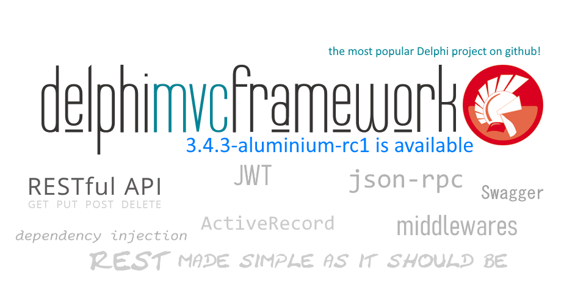

# DelphiMVCFramework 3.1.0-lithium is [here](https://github.com/danieleteti/delphimvcframework/releases/tag/v3.1.0-lithium)!

DelphiMVCFramework is the **most popular** Delphi project on GitHub!

**Daniele Teti is working on the [DelphiMVCFramework Handbook](https://leanpub.com/delphimvcframework)! Stay tuned!**


## How to install DMVCFramework
*It is not needed to download the git repository*. Just download the [latest version as a zip file](https://github.com/danieleteti/delphimvcframework/releases/latest) and you are ok.
If you want to participate to the testing phase (which usually contains brand new features) you can get the [latest Release Candidate version](https://github.com/danieleteti/delphimvcframework/releases).
Take in mind that, even if RCs are usually very stable, they are still not ready for production utilization.

## What users say about DMVCFramework

> "DMVCFramework and the Entity utility are fantastic!" -- Roberto

>"DMVCFramework is a great framework. It's very intuitive, fast, easy to use, actually there is nothing more to ask for." -- Samir

>"Wow! To do that in J2EE it takes 2 days" -- a training participant after a 5 minutes demo.

>"I'm starting with the DMVCFramework and I'm finding it fantastic, congratulations for the project!" -- Rafael

>"I'm looking at DMVCFramework project in it works great - for my use case scenarios is much better than *'Similar commercial product'*."  -- Luka

>"It's fantastic! Just define your entities and you are up and running in 5 minutes. Nothing comparable on the market." -- Marco

>"The best framework for creating web servers with Delphi! It is very easy to create Delphi servers and publish APIs and Rest resources.
Congratulations to Daniele Teti and all the staff for the excellent work!" -- Marcos N.

> We started the process of migrating our systems to micro services and are loving the DMVCFramework "DMVCFramework is definitely part of our lives right now". -- E. Costa

## DMVCFramework Main Features

  * Simple to use, check the ["Getting Started: 5 minutes guide"](https://danieleteti.gitbooks.io/delphimvcframework/content/chapter_getting_started.html) and you will be up and running in 5 minutes or less! (the guide is a bit outdated - a new book is being written by Daniele Teti. Let us know if you are interested in [DMVCFramework Handbook](https://leanpub.com/delphimvcframework))
  * [Project Roadmap](roadmap.md) is always public
	* More than 40 samples to learn all the features and be proficient and productive
* Commercially supported by [bit Time Professionals](http://www.bittimeprofessionals.it) (training, consultancy, custom development etc.)
  * RESTful (RMM Level 3) compliant
  * JSON-RPC 2.0 Support with automatic objects remotization (check [sample](https://github.com/danieleteti/delphimvcframework/tree/master/samples/jsonrpc_with_published_objects))
  * Stable and solid, used by small/mid/big projects since 2010
  * Very fast! (2.x was pretty fast and now, 3.x is 60% faster than the 2.x!)
  * Support group at https://www.facebook.com/groups/delphimvcframework with more than 2700 active members
  * Can be used in load balanced environment
  * Wizard for the Delphi IDE. It makes DelphiMVCFramework even more simple to use!
  * Optional session support
  * JSON Web Token Support (JWT) (check [sample](https://github.com/danieleteti/delphimvcframework/tree/master/samples/jsonwebtoken))
  * Extendable using middleware - simple hooks to handle request/response (check [sample](https://github.com/danieleteti/delphimvcframework/tree/master/samples/middleware))
  * Flexible yet simple to use, authorization/authentication framework based on industry standards.
    * HTTP Basic Authentication
    * JWT Authentication
    * Custom Authentication
  * CORS support
  * Controllers inheritance! You can define your own base controller and inherit from it.
  * Fancy URL with parameter mappings
  * Specialized renders to generate text, HTML, JSON.
  * Powerful and customizable mapper to serialize/deserialize data.
  * Can be packaged as stand alone server, apache module (XE6 or better) and ISAPI dll
  * Integrated REST Client
  * Works with Delphi 10 Seattle, Delphi 10.1 Berlin, Delphi 10.2 Tokyo, Delphi 10.3 Rio
  * Works on Linux (Delphi 10.2 Tokyo or better)
  * Completely unit tested (more than 130 unit tests)
  * There is a sample for each functionality (check the [dmvcframework_(yourversion)_samples.zip](https://github.com/danieleteti/delphimvcframework/releases))
  * Server side generated pages using [Mustache for Delphi](https://github.com/synopse/dmustache) or [TemplatePro](https://github.com/danieleteti/templatepro)
  * Specific trainings are available (email to `professionals@bittime.it` for a date and a place)
  * Push notifications support using [ServerSentEvents](https://github.com/danieleteti/delphimvcframework/tree/master/samples/serversentevents)
  * Automatic documentation through `/system/describeserver.info`
  * Driven by its huge community (Facebook group https://www.facebook.com/groups/delphimvcframework)
  * Semantic Versioning
  * Simple and [documented](docs/ITDevCON%202013%20-%20Introduction%20to%20DelphiMVCFramework.pdf)
  * Continuously tested for Delphi versions incompatibilities by the proud [compatibility maintainers](COMPATIBILITY_MANTAINERS.MD) 

## What's Cooking in the Lab

### DelphiMVCFramework 3.2.0-boron (currently in `RC` phase)

> WARNING! Considering the huge amount of features added in 3.1.1-beryllium during its RC phase, the dmvcframework-3.1.1-beryllium has been renamed to dmvcframework-3.2.0-boron

- New! Added Nullable support in MVCActiveRecord! Check *activerecord_showcase* sample.

- New! Added non autogenerated primary keys in MVCActiveRecord! Check *activerecord_showcase* sample.

- New! Complete support for nullable types in the default serializer.

- New! Added `ncCamelCase` and `ncPascalCase` to the available attribute formatters.

  | MVCNameCase  | Property/Field Name   | Rendered Name   |
  | ------------ | --------------------- | --------------- |
  | ncUpperCase  | Cod_Article           | COD_ARTICLE     |
  | ncLowerCase  | Cod_Article           | cod_article     |
  | ncPascalCase | Cod_Article           | CodArticle      |
  | ncPascalCase | CodArticle            | CodArticle      |
  | ncPascalCase | `_WITH__UNDERSCORES_` | WithUnderscores |
  | ncCamelCase  | Cod_Article           | codArticle      |
  | ncCamelCase  | CodArticle            | codArticle      |
  | ncCamelCase  | `_WITH__UNDERSCORES_` | WithUnderscores |
  |              |                       |                 |

- New! Added Swagger support (thanks to [João Antônio Duarte](https://github.com/joaoduarte19) and [Geoffrey Smith](https://github.com/geoffsmith82))
- New! **ObjectDict** function is the suggested way to render all the most common data types. It returns a `IMVCObjectDictionary` which is automatically rendered by the renders. Check the `renders.dproj` sample. Here's some example of the shining new `ObjectDict()`

**Example 1: Rendering a list of objects not freeing them after rendering**

*Classic*

```delphi
procedure TRenderSampleController.GetLotOfPeople;
begin
  Render<TPerson>(GetPeopleList, False);
end;

```

*New approach with ObjectDict*

```delphi
procedure TRenderSampleController.GetLotOfPeople;
begin
  Render(ObjectDict(False).Add('data', GetPeopleList));
end;

```


**Example 2: Rendering  a list of objects and automatically free them  after rendering**

*Classic*

```delphi
procedure TRenderSampleController.GetLotOfPeople;
begin
  Render<TPerson>(GetPeopleList);
end;

```

*New approach with ObjectDict*

```delphi
procedure TRenderSampleController.GetLotOfPeople;
begin
  Render(ObjectDict().Add('data', GetPeopleList));
end;

```

**Example 3: Rendering  a list of objects adding links for HATEOAS support**

*Classic*

```delphi
procedure TRenderSampleController.GetPeople_AsObjectList_HATEOAS;
var
  p: TPerson;
  People: TObjectList<TPerson>;
begin
  People := TObjectList<TPerson>.Create(True);

{$REGION 'Fake data'}
  p := TPerson.Create;
  p.FirstName := 'Daniele';
  p.LastName := 'Teti';
  p.DOB := EncodeDate(1979, 8, 4);
  p.Married := True;
  People.Add(p);

  p := TPerson.Create;
  p.FirstName := 'John';
  p.LastName := 'Doe';
  p.DOB := EncodeDate(1879, 10, 2);
  p.Married := False;
  People.Add(p);

  p := TPerson.Create;
  p.FirstName := 'Jane';
  p.LastName := 'Doe';
  p.DOB := EncodeDate(1883, 1, 5);
  p.Married := True;
  People.Add(p);
{$ENDREGION}

  Render<TPerson>(People, True,
    procedure(const APerson: TPerson; const Links: IMVCLinks)
    begin
      Links
       .AddRefLink
       .Add(HATEOAS.HREF, '/people/' + APerson.ID.ToString)
       .Add(HATEOAS.REL, 'self')
       .Add(HATEOAS._TYPE, 'application/json')
       .Add('title', 'Details for ' + APerson.FullName);
      Links
       .AddRefLink
       .Add(HATEOAS.HREF, '/people')
       .Add(HATEOAS.REL, 'people')
       .Add(HATEOAS._TYPE, 'application/json');
    end);
end;

```

*New approach with ObjectDict*

```delphi
procedure TRenderSampleController.GetPeople_AsObjectList_HATEOAS;
var
  p: TPerson;
  People: TObjectList<TPerson>;
begin
  People := TObjectList<TPerson>.Create(True);

{$REGION 'Fake data'}
  p := TPerson.Create;
  p.FirstName := 'Daniele';
  p.LastName := 'Teti';
  p.DOB := EncodeDate(1979, 8, 4);
  p.Married := True;
  People.Add(p);

  p := TPerson.Create;
  p.FirstName := 'John';
  p.LastName := 'Doe';
  p.DOB := EncodeDate(1879, 10, 2);
  p.Married := False;
  People.Add(p);

  p := TPerson.Create;
  p.FirstName := 'Jane';
  p.LastName := 'Doe';
  p.DOB := EncodeDate(1883, 1, 5);
  p.Married := True;
  People.Add(p);

{$ENDREGION}
 
  Render(ObjectDict().Add('data', People,
    procedure(const APerson: TObject; const Links: IMVCLinks)
    begin
      Links
        .AddRefLink
        .Add(HATEOAS.HREF, '/people/' + TPerson(APerson).ID.ToString)
        .Add(HATEOAS.REL, 'self')
        .Add(HATEOAS._TYPE, 'application/json')
        .Add('title', 'Details for ' + TPerson(APerson).FullName);
      Links
        .AddRefLink
        .Add(HATEOAS.HREF, '/people')
        .Add(HATEOAS.REL, 'people')
        .Add(HATEOAS._TYPE, 'application/json');
    end));
end;

```

`ObjectDict` is able to render multiple data sources (datasets, objectlists, objects or StrDict) at the same time using different casing, HATEOAS callbacks and modes.

```delphi
procedure TTestServerController.TestObjectDict;
var
  lDict: IMVCObjectDictionary;
begin
  lDict := ObjectDict(false)
    .Add('ncUpperCase_List', GetDataSet, nil, dstAllRecords, ncUpperCase)
    .Add('ncLowerCase_List', GetDataSet, nil, dstAllRecords, ncLowerCase)
    .Add('ncCamelCase_List', GetDataSet, nil, dstAllRecords, ncCamelCase)
    .Add('ncPascalCase_List', GetDataSet, nil, dstAllRecords, ncPascalCase)
    .Add('ncUpperCase_Single', GetDataSet, nil, dstSingleRecord, ncUpperCase)
    .Add('ncLowerCase_Single', GetDataSet, nil, dstSingleRecord, ncLowerCase)
    .Add('ncCamelCase_Single', GetDataSet, nil, dstSingleRecord, ncCamelCase)
    .Add('ncPascalCase_Single', GetDataSet, nil, dstSingleRecord, ncPascalCase)
    .Add('meta', StrDict(['page'], ['1']));
  Render(lDict);
end;

```
>ObjectDict is the suggested way to renders data. However, the other ones are still there and works as usual.

- New! Added SQLGenerator and RQL compiler for PostgreSQL, SQLite and MSSQLServer (in addition to MySQL, MariaDB, Firebird and Interbase)
- New! *MVCNameAs* attribute got the param `Fixed` (default: false). If Fixed is true, then the name is not processed by the `MVCNameCase` attribute assigned to the owner type.
- New! Added support for interfaces serialization - now it is possible to serialize Spring4D collections (thanks to [João Antônio Duarte](https://github.com/joaoduarte19))
- New! Added support for Spring4D Nullable Types - check  (thanks to [João Antônio Duarte](https://github.com/joaoduarte19))
- New! Added `OnRouterLog` event to log custom information for each request (thanks to [Andrea Ciotti](https://github.com/andreaciotti) for the first implementation and its PR)
- Added `TMVCJSONRPCExecutor.ConfigHTTPClient` to fully customize the inner `THTTPClient` (e.g. `ConnectionTimeout`, `ResponseTimeout` and so on)
- Improved! Now the router consider `Accept:*/*` compatible for every `MVCProduces` values
- Improved! Greatly improved support for [HATEOAS](https://en.wikipedia.org/wiki/HATEOAS) in renders. Check `TRenderSampleController.GetPeople_AsObjectList_HATEOS` and all the others actions end with `HATEOS` in `renders.dproj` sample)

```delphi
//Now is really easy to add "_links" property automatically for each collection element while rendering
Render<TPerson>(People, True,
    procedure(const APerson: TPerson; const Links: IMVCLinks)
    begin
      Links.AddRefLink
        .Add(HATEOAS.HREF, '/people/' + APerson.ID.ToString)
        .Add(HATEOAS.REL, 'self')
        .Add(HATEOAS._TYPE, 'application/json')
        .Add('title', 'Details for ' + APerson.FullName);
      Links.AddRefLink
        .Add(HATEOAS.HREF, '/people')
        .Add(HATEOAS.REL, 'people')
        .Add(HATEOAS._TYPE, 'application/json');
    end);

		
//Datasets have a similar anon method to do the same thing
Render(lDM.qryCustomers, False,
  procedure(const DS: TDataset; const Links: IMVCLinks)
  begin
	Links.AddRefLink
	  .Add(HATEOAS.HREF, '/customers/' + DS.FieldByName('cust_no').AsString)
	  .Add(HATEOAS.REL, 'self')
	  .Add(HATEOAS._TYPE, 'application/json');
	Links.AddRefLink
	  .Add(HATEOAS.HREF, '/customers/' + DS.FieldByName('cust_no').AsString + '/orders')
	  .Add(HATEOAS.REL, 'orders')
	  .Add(HATEOAS._TYPE, 'application/json');
  end);

//Single object rendering allows HATEOAS too!
Render(lPerson, False,
  procedure(const AObject: TObject; const Links: IMVCLinks)
  begin
	Links.AddRefLink
	  .Add(HATEOAS.HREF, '/people/' + TPerson(AObject).ID.ToString)
	  .Add(HATEOAS.REL, 'self')
	  .Add(HATEOAS._TYPE, TMVCMediaType.APPLICATION_JSON);
	Links.AddRefLink
	  .Add(HATEOAS.HREF, '/people')
	  .Add(HATEOAS.REL, 'people')
	  .Add(HATEOAS._TYPE, TMVCMediaType.APPLICATION_JSON);
  end);
	
```

- Better packages organization (check `packages` folder)
- New! `TMVCActiveRecord.Count` method (e.g. `TMVCActiveRecord.Count(TCustomer)` returns the number of records for the entity mapped by the class `TCustomer`)
- Change! `TMVCACtiveRecord.GetByPK<T>` raises an exception by default if the record is not found - optionally can returns `nil` using new parameter `RaiseExceptionIfNotFound` 
- New! `contains` clause has been added in the RQL compiler for Firebird and Interbase
- New! `TMVCAnalyticsMiddleware` to do automatic analytics on the API (generates a CSV file). Based on an idea by Nirav Kaku (https://www.facebook.com/nirav.kaku). Check the sample in `\samples\middleware_analytics\`
- New! `TMVCActiveRecord.DeleteAll` deletes all the records from a table
- New! `TMVCActiveRecord.DeleteRQL` deletes records using an `RQL` expression as `where` clause.
- New! `TMVCActiveRecord.Store` which automatically executes Insert or Update considering primary key value.
- New! `TMVCActiveRecord` allows to use table name and field name with spaces (currently supported only by the PostgreSQL compiler). 
- New! Microsoft SQLServer Support in `MVCActiveRecord` and RQL (*thanks to one of the biggest Delphi based company in Italy which heavily uses DMVCFramework* and *[DMSContainer](http://www.bittimeprofessionals.it/prodotti/dmscontainer)*)
- New! SQLite support in `MVCActiveRecord` and RQL, so that `MVCActiveRecord` can be used also for Delphi mobile projects!
- Default JSON Serializer can verbatim pass properties with type `JsonDataObjects.TJSONObject` without  using `string` as carrier of JSON
- Improved! `ActiveRecordShowCase` sample is much better now.
- Improved! All `ActiveRecord` methods which retrieve records can now specify the data type of each parameter (using Delphi's `TFieldType` enumeration).
- Improved! In case of unhandled exception `TMVCEngine` is compliant with the default response content-type (usually it did would reply using `text/plain`).
- Added! New overloads for all the Log\* calls. Now it is possible to call `LogD(lMyObject)` to get logged `lMyObject` as JSON (custom type serializers not supported in log).
- New! `StrDict(array of string, array of string)` function allows to render a dictionary of strings in a really simple way. See the following action sample.
```delphi
procedure TMy.GetPeople(const Value: Integer);
begin
  if Value mod 2 <> 0 then
  begin
    raise EMVCException.Create(HTTP_STATUS.NotAcceptable, 'We don''t like odd numbers');
  end;
  Render(
    StrDict(
      ['id', 'message'],
      ['123', 'We like even numbers, thank you for your ' + Value.ToString]
    ));
end;
```
- New! Custom Exception Handling (Based on work of [David Moorhouse](https://github.com/fastbike)). Sample "custom_exception_handling" show how to use it.

- Improved! Exceptions rendering while using MIME types different to `application/json`.

- Improved! JSONRPC Automatic Object Publishing can not invoke inherited methods if not explicitly defined with `MVCInheritable` attribute.

- New! JSONRPC Hooks for published objects

  ```delphi
  //Called before as soon as the HTTP arrives
  procedure TMyPublishedObject.OnBeforeRouting(const JSON: TJDOJsonObject);
  
  //Called before the invoked method
  procedure TMyPublishedObject.OnBeforeCall(const JSONRequest: TJDOJsonObject);
  
  //Called just before to send response to the client
  procedure TMyPublishedObject.OnBeforeSendResponse(const JSONResponse: TJDOJsonObject);
  
  ```

  

- SSL Server support for `TMVCListener` (Thanks to [Sven Harazim](https://github.com/landrix))

- Improved! Datasets serialization speed improvement. In some case the performance [improves of 2 order of magnitude](https://github.com/danieleteti/delphimvcframework/issues/205#issuecomment-479513158). (Thanks to https://github.com/pedrooliveira01)

- New! Added `in` operator in RQL parser (Thank you to [João Antônio Duarte](https://github.com/joaoduarte19) for his initial work on this)

- New! Added `TMVCActiveRecord.Count<T>(RQL)` to count record based on RQL criteria

- New! `TMVCActiveRecord` can handle non  autogenerated primary key.

- New! Calling `<jsonrpcendpoint>/describe` returns the methods list available for that endpoint.

- New! Experimental (alpha stage) support for Android servers!

- New! Added support for `X-HTTP-Method-Override` to work behind corporate firewalls.

- New Sample! Server in DLL

- Added new method in the dataset helper to load data into a dataset from a specific JSONArray property of a JSONObject   `procedure TDataSetHelper.LoadJSONArrayFromJSONObjectProperty(const AJSONObjectString: string; const aPropertyName: String);` 

- Improved! New constants defined in `HTTP_STATUS` to better describe the http status response.

- Improved! Now Firebird RQL' SQLGenerator can include primary key in `CreateInsert` if not autogenerated.

- New! Added support for `TArray<String>`, `TArray<Integer>` and `TArray<Double>` in default JSON serializer (Thank you [Pedro Oliveira](https://github.com/pedrooliveira01))

- Improved JWT Standard Compliance! Thanks to [Vinicius Sanchez](https://github.com/viniciussanchez) for his work on [issue #241](https://github.com/danieleteti/delphimvcframework/issues/241)

- Improved! DMVCFramework now has 130+ unit tests that checks its functionalities at each build!

- New! `StrToJSONObject` function to safely parse a string into a JSON object.

- New! Serialization callback for custom `TDataSet` descendants serialization in `TMVCJsonDataObjectsSerializer`.
```delphi
procedure TMainForm.btnDataSetToJSONArrayClick(Sender: TObject);
var
  lSer: TMVCJsonDataObjectsSerializer;
  lJArray: TJSONArray;
begin
  FDQuery1.Open();
  lSer := TMVCJsonDataObjectsSerializer.Create;
  try
    lJArray := TJSONArray.Create;
    try
      lSer.DataSetToJsonArray(FDQuery1, lJArray, TMVCNameCase.ncLowerCase, [],
        procedure(const aField: TField; const aJsonObject: TJSONObject; var Handled: Boolean)
        begin
          if SameText(aField.FieldName, 'created_at') then
          begin
            aJsonObject.S['year_and_month'] := FormatDateTime('yyyy-mm', TDateTimeField(aField).Value);
            Handled := True;
          end;
        end);
	  //The json objects will not contains "created_at" anymore, but only "year_and_month".
      Memo1.Lines.Text := lJArray.ToJSON(false);
    finally
      lJArray.Free;
    end;
  finally
    lSer.Free;
  end;
end;
```
- New! Shortcut render' methods which simplify RESTful API development
    - `procedure Render201Created(const Location: String = ''; const Reason: String = 'Created'); virtual;`
    - `    procedure Render202Accepted(const HREF: String; const ID: String; const Reason: String = 'Accepted'); virtual;`
    - `procedure Render204NoContent(const Reason: String = 'No Content'); virtual;`
    
- Added de/serializing iterables (e.g. generic lists) support without `MVCListOf` attribute (Thank you to [João Antônio Duarte](https://github.com/joaoduarte19)).

    It is now possible to deserialize a generic class like this:

    ```delphi
      TGenericEntity<T: class> = class
      private
        FCode: Integer;
        FItems: TObjectList<T>;
        FDescription: string;
      public
        constructor Create;
        destructor Destroy; override;
        property Code: Integer read FCode write FCode;
        property Description: string read FDescription write FDescription;
        // MVCListOf(T) <- No need
        property Items: TObjectList<T> read FItems write FItems;
      end;
    ```

    Before it was not possible because you should add the `MVCListOf` attribute to the `TObjectList` type property.

- New! The **MVCAREntitiesGenerator** can optionally register all the generated entities also in the `ActiveRecordMappingRegistry` (Thanks to [Fabrizio Bitti](https://twitter.com/fabriziobitti) from [bit Time Software](http://www.bittime.it))

- Fixed! [issue38](https://github.com/danieleteti/delphimvcframework/issues/38)

- Fixed! [issue184](https://github.com/danieleteti/delphimvcframework/issues/184)

- Fixed! [issue278](https://github.com/danieleteti/delphimvcframework/issues/278)

- Fixed! [issue164](https://github.com/danieleteti/delphimvcframework/issues/164)

- Fixed! [issue182](https://github.com/danieleteti/delphimvcframework/issues/182)

- Fixed! [issue232](https://github.com/danieleteti/delphimvcframework/issues/232) (Thanks to [João Antônio Duarte](https://github.com/joaoduarte19))

- Fixed! [issue289](https://github.com/danieleteti/delphimvcframework/issues/289) (Thanks to [João Antônio Duarte](https://github.com/joaoduarte19))

- Fixed! [issue291](https://github.com/danieleteti/delphimvcframework/issues/291) (Thanks to [João Antônio Duarte](https://github.com/joaoduarte19))

- Fixed! [issue305](https://github.com/danieleteti/delphimvcframework/issues/305) (Thanks to [João Antônio Duarte](https://github.com/joaoduarte19))

- Fixed! [issue312](https://github.com/danieleteti/delphimvcframework/issues/312)

- Fixed! [issue330](https://github.com/danieleteti/delphimvcframework/issues/330)

- Fixed! [issue333](https://github.com/danieleteti/delphimvcframework/issues/333)

- Fixed! [issue334](https://github.com/danieleteti/delphimvcframework/issues/334)

- Fixed! [issue336](https://github.com/danieleteti/delphimvcframework/issues/336)

- Fixed! [issue337](https://github.com/danieleteti/delphimvcframework/issues/337)

- Fixed! [issue338](https://github.com/danieleteti/delphimvcframework/issues/338)

- Fixed! [issue345](https://github.com/danieleteti/delphimvcframework/issues/345)

- Fixed! [issue349](https://github.com/danieleteti/delphimvcframework/issues/349)

- Fixed! [issue350](https://github.com/danieleteti/delphimvcframework/issues/350)

- Fixed! [issue355](https://github.com/danieleteti/delphimvcframework/issues/355)

- Fixed! [issue356](https://github.com/danieleteti/delphimvcframework/issues/356)

- Fixed! [issue362](https://github.com/danieleteti/delphimvcframework/issues/362)

- Fixed! [issue363](https://github.com/danieleteti/delphimvcframework/issues/363)

- Fixed! [issue366](https://github.com/danieleteti/delphimvcframework/issues/366)

- **Breaking Change!** In `MVCActiveRecord` attribute `MVCPrimaryKey` has been removed and merged with `MVCTableField`, so now `TMVCActiveRecordFieldOption` is a set of `foPrimaryKey`, `foAutoGenerated`, `foTransient` (check `activerecord_showcase.dproj` sample).

- **Breaking Change!** Middleware `OnAfterControllerAction` are now invoked in the same order of `OnBeforeControllerAction` (previously were invoked in reversed order).

- **Deprecated!** `TDataSetHolder` is deprecated! Use the shining new `ObjectDict(boolean)` instead.

- Fixed! Has been patched a serious security bug affecting deployment configurations which uses internal WebServer to serve static files (do not affect all Apache, IIS or proxied deployments).  Thanks to **Stephan Munz** to have discovered it. *Update to dmvcframework-3.2-RC5+ is required for all such kind of deployments.*

- Added ability to serialize/deserialize types enumerated by an array of mapped values (Thanks to [João Antônio Duarte](https://github.com/joaoduarte19))

    ```delphi
    type
      TMonthEnum = (meJanuary, meFebruary, meMarch, meApril);
    
      TEntityWithEnums = class
      private
        FMonthMappedNames: TMonthEnum;
        FMonthEnumName: TMonthEnum;    
        FMonthOrder: TMonthEnum;    
      public
        // List items separated by comma or semicolon
        [MVCEnumSerializationType(estEnumMappedValues,
        	'January,February,March,April')]
        property MonthMappedNames: TMonthEnum 
        	read FMonthMappedNames write FMonthMappedNames;
        [MVCEnumSerializationType(estEnumName)]
        property MonthEnumName: TMonthEnum 
        	read FMonthEnumName write FMonthEnumName;
        [MVCEnumSerializationType(estEnumOrd)]
        property MonthOrder: TMonthEnum read FMonthOrder write FMonthOrder;
      end;
    ...
    ```

- New Installation procedure! 

    - Open the project group (select the correct one from the following table)
    - Build all 
    - Install the design-time package (`dmvcframeworkDT`)
    - Add the following paths in the Delphi Library Path (here, `C:\DEV\dmvcframework` is the `dmvcframework` main folder)
        - `C:\DEV\dmvcframework\sources`
        - `C:\DEV\dmvcframework\lib\loggerpro`
        - `C:\DEV\dmvcframework\lib\swagdoc\Source`
        - `C:\DEV\dmvcframework\lib\dmustache`

|Delphi Version|Project Group|
|---|---|
|Delphi 10.3 Rio| `packages\d103\dmvcframework_group.groupproj`|
|Delphi 10.2 Tokyo| `packages\d102\dmvcframework_group.groupproj`|
|Delphi 10.1 Berlin| `packages\d101\dmvcframework_group.groupproj`|
|Delphi 10.0 Seattle| `packages\d100\dmvcframework_group.groupproj`|

## DelphiMVCFramework 3.1.0-lithium (Current Release)

- New! Added `TMVCActiveRecord` framework (check sample `activerecord_showcase` and `activerecord_crud`)
- New! Added `TMVCActiveRecordController` (check sample `activerecord_crud`)
- Automatic permissions handling for `TMVCActiveRecordController` (check sample `activerecord_crud`)
- EntityProcessor for `TMVCActiveRecordController` (check sample `activerecord_crud`)
- `Config[TMVCConfigKey.FallbackResource]` is served only if request path is empty or `/`.
- New! Now the JSON-RPC executor provides methods to handle HTTP headers for JSON-RPC requests and notifications.
- `TDataSetHolder` is a new render able to render a dataset with a set of custom metadata (eg `count`,`page` etc). Check [issue #137](https://github.com/danieleteti/delphimvcframework/issues/137)
- `404` and `500` status code returns always a `text/plain` content-type
- Refactored ISAPI sample
- Speed improvement! Removed enhanced visibility for action methods. Now only public and published methods can be used as actions.
- `TMVCController.Create` is `virtual`! Now on your base controllers can be even more powerful!
- New! Added `MAX_REQUEST_SIZE` for limiting the size of the incoming HTTP requests. IDE Expert is updated too!
- New! Added method `TMVCJsonDataObjectsSerializer.ListToJsonArray`
- New! `TMVCResponse` for handle generic (non error) response
- New! `TMVCErrorResponse` for handle generic error response
- New! Added class `TMVCActiveRecordList` used in the manual `TMVCActiveRecord` programming
- New! Added `gzip` compression support in addition to `deflate` in `TCompressionMiddleware`
- FIX for [issue #143](https://github.com/danieleteti/delphimvcframework/issues/143)
- FIX for [issue #141](https://github.com/danieleteti/delphimvcframework/issues/141)
- Removed deprecated methods in `IRESTResponse`
- FIX misspelled header name in `IRESTResponse`
- New! Added `gzip` and `deflate` support in `TRestClient` when reading responses
- `TCompressionMiddleware` has been renamed in `TMVCCompressionMiddleware`
- New! `TMVCCompressionMiddleware` is added by IDE Expert by default
- Removed the old JSON serializer based on `System.JSON.pas', now the only available JSON serializer is based on [JsonDataObjects](https://github.com/ahausladen/JsonDataObjects) parser (Thank you Andreas Hausladen).
- Changed! Custom Types Serializer *must* be registered by media-type only, without charset definition (e.g. just `application/json` and not `application/json;charset=utf-8`)
- Changed! `IMVCTypeSerializer` is more powerful and simple to use!
- Sending wrongly formatted JSON now returns a more correctly `400 Bad Request` and not `500 Internal Server Error` as in the previous versions
- New! Support for Spring4d nullable types (check `samples\renders_spring4d_nullables`)
- New! `TMVCJSONRPCPublisher` allows to easily expose plain Delphi objects (and even datamodules) through a JSON-RPC 2.0 interface!
- *Breaking Change!* The JSON RPC Client layer is now interface based.

## Roadmap
DelphiMVCFramework roadmap is always updated as-soon-as the features planned are implemented. Check the roadmap [here](roadmap.md).

## Trainings, consultancy or custom development service
As you know, good support on open source software is a must for professional users.
If you need trainings, consultancy or custom developments on DelphiMVCFramework, send an email to *dmvcframework at bittime dot it*. Alternatively you can send a request using the [contacts forms](http://www.bittimeprofessionals.it/contatti) on [bit Time Professionals website](http://www.bittimeprofessionals.it). bit Time Professionals is the company behind DelphiMVCFramework, all the main developers works there.

## Release Notes
#### 3.1.0 (lithium)

- `TMVCActiveRecord` framework
- `TMVCActiveRecordController`  with automatic RESTful interface generation and permissions handling
- EntityProcessor for `TMVCActiveRecordController` to handle complex cases
- JSON-RPC executor allows to configure HTTP headers for JSON-RPC requests and notifications.
- `TDataSetHolder` 
- `404` and `500` status code returns always a `text/plain` content-type
- Speed improvement! 
- `MAX_REQUEST_SIZE` can now limit the size of the incoming HTTP requests.
- `TMVCResponse` can handle generic (non error) responses
- `gzip` compression support in addition to `deflate` in `TCompressionMiddleware`
- `TCompressionMiddleware` has been renamed in `TMVCCompressionMiddleware`
- Support for Spring4d nullable types (check `samples\renders_spring4d_nullables`)
- `TMVCJSONRPCPublisher` allows to easily expose plain Delphi objects (and even data modules) through a JSON-RPC 2.0 interface!
- *Breaking Change!* The JSON RPC Client layer is now interface based.

#### 3.0.0 (hydrogen)

  - First release of the 3.0.0 version

#### 2.1.3 (lithium)

  - FIX https://github.com/danieleteti/delphimvcframework/issues/64
  - Added unit tests to avoid regressions

#### 2.1.2 (helium)

  - FIX for Delphi versions who don't have ```TJSONBool``` (Delphi XE8 or older)
  - Added new conditional define in dmvcframework.inc: JSONBOOL (defined for Delphi Seattle+)

#### 2.1.1 (hydrogen)

  - Updated the IDE Expert to show the current version of the framework
  - FIX to the mapper about the datasets null values (needs to be checked in old Delphi versions)
  - ADDED support for Boolean values in datasets serialization
  - ADDED unit tests about Mapper and dataset fields nullability
  - The current version is available in constant ```DMVCFRAMEWORK_VERSION``` defined in ```MVCFramework.Commons.pas```

## Samples and documentation
DMVCFramework is provided with a lot of examples focused on specific functionality.
All samples are in [Samples](samples) folder.
Check the [DMVCFramework Developer Guide](https://danieleteti.gitbooks.io/delphimvcframework/content/) (work in progress).


# Getting Started
Below the is a basic sample of a DMVCFramework server wich can be deployed as standa-alone application, as an Apache module or as ISAPI dll. This flexibility is provided by the Delphi WebBroker framework (built-in in Delphi since Delphi 4).
The project contains an IDE Expert which make creating DMVCFramework project a breeze. However not all the Delphi version are supported, so here's the manual version (which is not complicated at all).

To create this server, you have to create a new ```Delphi Projects -> WebBroker -> WebServerApplication```. Then add the following changes to the webmodule.
```delphi
unit WebModuleUnit1;

interface

uses System.SysUtils, System.Classes, Web.HTTPApp, MVCFramework {this unit contains TMVCEngine class};

type
  TWebModule1 = class(TWebModule)
    procedure WebModuleCreate(Sender: TObject);
    procedure WebModuleDestroy(Sender: TObject);

  private
    MVC: TMVCEngine;

  public
    { Public declarations }
  end;

var
  WebModuleClass: TComponentClass = TWebModule1;

implementation

{$R *.dfm}

uses UsersControllerU; //this is the unit where is defined the controller

procedure TWebModule1.WebModuleCreate(Sender: TObject);
begin
  MVC := TMVCEngine.Create(Self);
  MVC.Config[TMVCConfigKey.DocumentRoot] := 'public_html'; //if you need some static html, javascript, etc (optional)
  MVC.AddController(TUsersController); //see next section to know how to create a controller
end;

procedure TWebModule1.WebModuleDestroy(Sender: TObject);
begin
  MVC.Free;
end;

end.
```

That's it! You have just created your first DelphiMVCFramework. Now you have to add a controller to respond to the http request.

## Sample Controller
Below a basic sample of a DMVCFramework controller with 2 action

```delphi
unit UsersControllerU;
  
interface
  
uses 
  MVCFramework;
 
type 
   [MVCPath('/users')]
   TUsersController = class(TMVCController)
   public

    //The following action will be with a GET request like the following
    //http://myserver.com/users/3
    [MVCPath('/($id)')]
    [MVCProduces('application/json')]
    [MVCHTTPMethod([httpGET])]
    [MVCDoc('Returns a user as a JSON object')]
    procedure GetUser(id: Integer);

    
    //The following action will be with a GET request like the following
    //http://myserver.com/users
    [MVCPath('/')]
    [MVCProduces('application/json')]
    [MVCHTTPMethod([httpGET])]
    [MVCDoc('Returns the users list as a JSON Array of JSON Objects')]
    procedure GetUsers;

    //The following action will be with a PUT request like the following
    //http://myserver.com/users/3
    //and in the request body there should be a serialized TUser
    [MVCPath('/($id)')]
    [MVCProduce('application/json')]
    [MVCHTTPMethod([httpPUT])]
    [MVCDoc('Update a user')]    
    procedure UpdateUser(id: Integer);

    //The following action will respond to a POST request like the following
    //http://myserver.com/users
    //and in the request body there should be the new user to create as json
    [MVCPath]
    [MVCProduce('application/json')]
    [MVCHTTPMethod([httpPOST])]
    [MVCDoc('Create a new user, returns the id of the new user')]
    procedure CreateUser;

  end;
 
implementation

uses
  MyTransactionScript; //contains actual data access code
  
{ TUsersController }

procedure TUsersController.GetUsers;
var
  Users: TObjectList<TUser>;
begin
  Users := GetUsers;
  Render(Users);
end;
 
procedure TUsersController.GetUser(id: Integer);
var
  User: TUser;
begin
  User := GetUserById(id);
  Render(User);
end;

procedure TUsersController.UpdateUser(id: Integer);
var
  User: TUser;
begin
  User := Context.Request.BodyAs<TUser>;
  UpdateUser(id, User);
  Render(User);
end;	
  
procedure TUsersController.CreateUser;
var
  User: TUser;
begin
  User := Context.Request.BodyAs<TUser>;
  CreateUser(User);
  Render(User);
end;	
  
end.
```

Now you have a performant RESTful server wich respond to the following URLs:
- GET /users/($id)		(eg. /users/1, /users/45 etc)
- PUT /users/($id)		(eg. /users/1, /users/45 etc with the JSON data in the request body)
- POST /users			(the JSON data must be in the request body)

### Quick Creation of DelphiMVCFramework Server

If you dont plan to deploy your DMVCFramework server behind a webserver (apache or IIS) you can also pack more than one listener application server into one single executable. In this case, the process is a bit different and involves the creation of a listener context. However, create a new server is a simple task:

```delphi
uses
  MVCFramework.Server,
  MVCFramework.Server.Impl;

var
  LServerListener: IMVCListener;
begin
  LServerListener := TMVCListener.Create(TMVCListenerProperties.New
	 .SetName('Listener1')
	 .SetPort(5000)
	 .SetMaxConnections(1024)
	 .SetWebModuleClass(YourServerWebModuleClass)
   );  

  LServerListener.Start;
  LServerListener.Stop;
end;
```

If you want to add a layer of security (in its WebModule you should add the security middleware):

```delphi
uses
  MVCFramework.Server,
  MVCFramework.Server.Impl,
  MVCFramework.Middleware.Authentication;

procedure TTestWebModule.WebModuleCreate(Sender: TObject);
begin
  FMVCEngine := TMVCEngine.Create(Self);
	
  // Add Yours Controllers
  FMVCEngine.AddController(TYourController);
	
  // Add Security Middleware
  FMVCEngine.AddMiddleware(TMVCBasicAuthenticationMiddleware.Create(
    TMVCDefaultAuthenticationHandler.New
    .SetOnAuthentication(
		procedure(const AUserName, APassword: string;
		  AUserRoles: TList<string>; var IsValid: Boolean; 
		  const ASessionData: TDictionary<String, String>)
		begin
		  IsValid := AUserName.Equals('dmvc') and APassword.Equals('123');
		end
		)
    ));
end;  
```

In stand alone mode you can work with a context that supports multiple listeners servers:

```delphi
uses
  MVCFramework.Server,
  MVCFramework.Server.Impl;

var
  LServerListenerCtx: IMVCListenersContext;

begin
  LServerListenerCtx := TMVCListenersContext.Create;

  LServerListenerCtx.Add(TMVCListenerProperties.New
    .SetName('Listener1')
    .SetPort(6000)
    .SetMaxConnections(1024)
    .SetWebModuleClass(WebModuleClass1)
    );

  LServerListenerCtx.Add(TMVCListenerProperties.New
    .SetName('Listener2')
    .SetPort(7000)
    .SetMaxConnections(1024)
    .SetWebModuleClass(WebModuleClass2)
    );

  LServerListenerCtx.StartAll;
end;  
```

### Links
Feel free to ask questions on the "Delphi MVC Framework" facebook group (https://www.facebook.com/groups/delphimvcframework).

