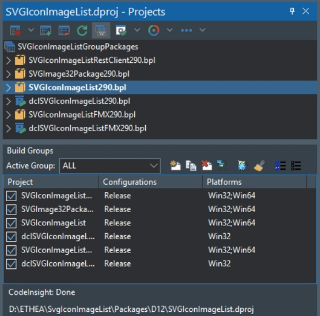
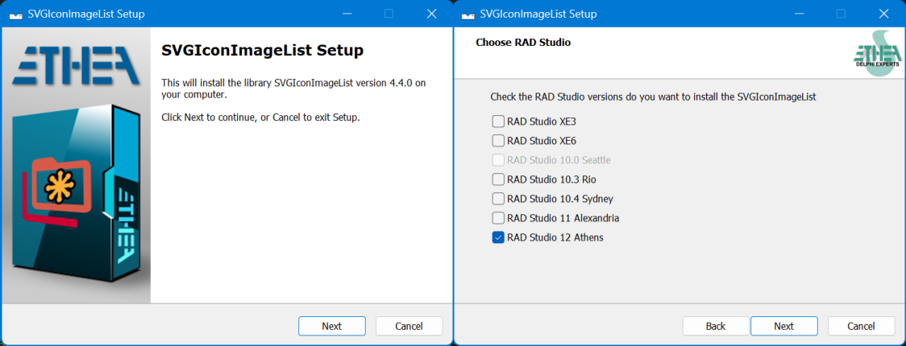

# InnoSetup Scripts for Embarcadero RAD Studio<sup>©</sup> Components Installer

[](https://opensource.org/licenses/MIT)

## A collection of InnoSetup Scripts to build a RAD Studio Setup for Delphi Packages of Components and Libraries of any types.

### Actual official version 1.1.0

Copyright <sup>©</sup> 2024-2025 Ethea S.r.l.
Original Code is Copyright <sup>©</sup> 2021-2025 Skia4Delphi Project.
Use of this source code is governed by the MIT license.

## Scope of this Scripts collection

Many developers of Delphi components/libraries release their sources on Git-Hub, providing instructions for manually installing the packages.

Using these scripts for InnoSetup Compiler it is possible to create an "automatic" Setup capable of:

- Install the project in the folder selected by the user.
- Copy all the files of the project (Sources, resources, Packages, help...).
- Determine the versions of Delphi present on the machine.
- Compile the packages (dcp), creating the 32 and 64 Bit dcu.
- Install the Packages (bpl) in the CommonBplFolder of Delphi
- Create an environment variable
- Add search paths using the environment variable

During an update, Setup is also capable to:

- Uninstall the previous version of the Packages (eventually from Get-It)
- Remove old sources and files
- Delete old .dcp and .bpl files from CommonBplFolder and CommonDcpFolder
- Proceed with the new Installation

After the installation, the components/libraries are available into the IDE of Delphi and ready to use!

## How to use

Prerequisites: download and install latest [Inno Setup Compiler](https://jrsoftware.org/download.php/is.exe?site=1)

### Files preparation:

1. In your components/Library Project create a Setup Folder
2. Clone this Repo into Setup/InnoSetupScripts
3. Place the "\Template\Setup.iss" file into your Setup Folder
4. Copy \Template\*.bmp files into your Setup Folder (WizClassicImage.bmp and WizClassicSmallImage.bmp)

Verify to have this structure:
```Shell
Setup
│ Setup.iss
│ WizClassicImage.bmp
│ WizClassicSmallImage.bmp
└─\InnoSetupScripts
│ └─\Languages
│     Default.isl
│     Italian.isl
│     ...
└───\Scripts
    │ Setup.Preprocessor.ClearFiles.bat
└───\Source
    │ Setup.Main.inc
    │ RADStudio.inc
    │ ...
└───\Style
    │ Amakrits.vsf
    │ ...
    │ YellowGraphite.vsf
    │ Setup.Styles.dll
```

### Customize Setup:

1. Customize your graphics changing the content of the bitmaps WizClassicImage.bmp and WizClassicSmallImage.bmp
2. Open "Setup.iss" with Inno Setup Compiler IDE and change values after "TODO:" lables

## Prepare your Packages for Build

The Setup scripts automatically search in your Package folder all the packages to install, inside a GroupProject file.

### Setup your Package Groups:

You must collect your packages in PackageGroups.

Into every Package Group you must create a "Build group" called "ALL" in this way:

1. Open the PackageGroup file (.groupproj)

1. Click tothe Icon "Show Build Groups Pane" in the toolbar

1. In the "Build Groups Panel", click to the icon "Create a new build group"

1. Input "ALL" as the name of the Build Group

1. All of your packages are created and selected by default

1. Change the column "Configurations" to include Release (and also Debug if you want to provide also .dcu in debug mode)

1. Change the column "Platforms" to include Win64 (only for run-time packages)

This is an example of the "Build Groups Panel":



### WARNING:

Check in your .dproj xml file, if contains the correct "ProjectVersion" number, because the scripts use it to known the correct Delphi Version.

for Example, for Delphi 12.3 ProjectVersion must be 20.3:

```xml
<Project xmlns="http://schemas.microsoft.com/developer/msbuild/2003">
    <PropertyGroup>
        <ProjectGuid>{00000000-0000-0000-0000-000000000000}</ProjectGuid>
        <MainSource>PackageName.dpk</MainSource>
        <ProjectVersion>20.2</ProjectVersion>
```

Use this table for the correct "ProjectVersion" of every Delphi versions:

|  RAD Studio Version      | Min ProjectVersion | Max ProjectVersion | LibSuffix**    |
| :----------------------- | :----------------- | :----------------- | :------------- |
| RAD Studio XE3           | 14.0               | 14.4               | 170            |
| RAD Studio XE6           | 15.1               | 15.4               | 200            |
| RAD Studio XE7           | 16.0               | 16.1               | 210            |
| RAD Studio XE8           | 17.1               | 17.2               | 220            |
| RAD Studio 10.0 Seattle  | 18.0               | 18.1\*             | 230            |
| RAD Studio 10.1 Berlin   | 18.1\*             | 18.2\*             | 240            |
| RAD Studio 10.2 Tokyo    | 18.2\*             | 18.4               | 250            |
| RAD Studio 10.3 Rio      | 18.5               | 18.8               | 260            |
| RAD Studio 10.4 Sydney   | 19.0               | 19.2               | 270 or $(Auto) |
| RAD Studio 11 Alexandria | 19.3               | 19.5               | 280 or $(Auto) |
| RAD Studio 12 Athens     | 20.1               | 20.3               | 290 or $(Auto) |

\*In case of conflict the script searches for Package Version\*\* (LibSuffix), so it is recommended to use "standard" Lib Suffix values.

If you need other versions not included in this table you must edit RADStudio.inc file to include them in:

```Pascal
procedure _InitializationUnitRADStudio
```

## Compile and Run Installer

Build and Run Setup.iss to check your installation and debug the Setup.

Check your "graphics" in first page (WizClassicImage.bmp) and in another pages (WizClassicSmallImage.bmp)

Check if the Setup acquire your Delphi versions available.



If you have some problems to Build and install packages read carefully the log provided by the installer.

After the installation check your Evironment Variable in Delphi IDE and Search Paths added by the installer.

# License

## Copyright <sup>©</sup> 2024-2025 Ethea S.r.l.

  License [MIT-License](https://github.com/skia4delphi/skia4delphi?tab=MIT-1-ov-file)

## The original author of the Scripts are: Skia4Delphi Library by [the authors](https://skia4delphi.org/)

  License [MIT-License](https://github.com/skia4delphi/skia4delphi?tab=MIT-1-ov-file)

### RELEASE NOTES
27 Feb 2025: version 1.1.0
- Added support to build design-time 64bit Packages for Delphi 12.3
- Added support for Delphi 12.3

2 Jan 2025: version 1.0.0
- Added support for bpl packages built in RAD Studio Common Bpl Folders
- Added various Styles form customization of Setup
- Added Italian language translation

